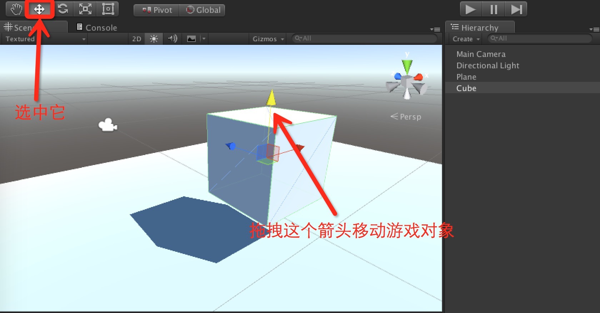
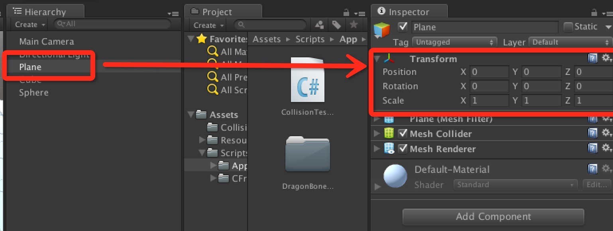

# Unity场景编辑与场景漫游快捷键

## 一、创建场景

打开Unity主窗口，选择顶部菜单栏的“GameObject”->“3D Object”->“Plane”在游戏场景里面添加一个面板对象。然后再创建一个“Cube”（立方体）对象。这样场景就会如下图所示：

会发现面板和立方体卡在了同一个位置上面，我们想要将立方体置于面板的上面，这时候就需要对场景内的游戏对象进行编辑。 

## 二、编辑场景

在Unity主窗口的左上角有一组专门用于编辑游戏对象的工具栏（被红色方框圈住地方）。其从左往右依次是：**手型工具、平移工具、旋转工具、缩放工具和精灵工具**。 

### 2.1、手型工具

**手型工具**处于选中状态时，我们可以通过按住鼠标左键并移动鼠标来拖拽整个游戏场景，然后Scene视图显示场景的不同位置，这样我们可以对游戏场景的不同位置进行编辑。

### 2.2、平移工具

**平移工具**处于选中状态时，我们用鼠标单击场景内的某个游戏对象，该对象上会出现三个不同颜色的剪头，分别指向x、y和z三个轴的正方向。这时候使用鼠标任意拖动某个箭头便可以移动游戏对象。

### 2.3、旋转工具

**旋转工具**处于选中状态时，我们用鼠标单击场景内的某个游戏对象，该对象周围会出现三个带颜色的圈，从不同的角度圈住游戏对象。这时候如果我们随意拖动一个圈，游戏对象便会绕对应的某个轴进行旋转。

### 2.4、缩放工具

**缩放工具**处于选中状态时，我们用鼠标单击场景内的有个游戏对象，改对象上会出现三个类似平移标识的箭头。只是这个箭头的顶端不是尖锐的，而是一个立方体。我们用鼠标拖拽任意的箭头便可以对游戏对象进行缩放操作。

### 2.5、精灵工具

在缩放工具的右边，紧挨的是**精灵工具**。它主要是针对Unity 2D游戏对象进行编辑的工具，这里暂且不谈。

### 2.6、快捷键

手型工具、平移工具、旋转工具、缩放工具和精灵工具，除了使用鼠标点击的方式选中外，它们各自还绑定了一个快捷键。其从左往右对应的快捷按键分别是：Q、W、E、R和T。当我们按下这五个按键中的某一个时，对应的工具栏按钮便会处于选中状态，这样我们可以更加快速的编辑游戏场景。

### 2.7、聚焦

* 为了方便配合上面的五个工具栏操作，我们还可以在Hierarchy面板上面用鼠标双击某个游戏对象，这时候Scene视图会快速聚焦到被选中的那个游戏对象上。

* 平移工具、旋转工具或者缩放工具被选中时，我们再选中某个游戏对象，然后按下键盘的F键，Scene视图会迅速将画面移动到对应的游戏对象上方便对其进行编辑。

### 2.8、观察游戏对象

* 当某个物体被选中后，我们可以通过按住alt键（mac为option键），并按住鼠标左键移动鼠标来对该游戏物体进行全方位的观察。如果将左键换成了鼠标右键，则会以该游戏对象为锚点，进行场景的拉近拉远观看。

* 鼠标位于Scene视图中时，滚动鼠标滚轮（鼠标中键）也可以对Scene视图进行拉近拉远观看。

* 另外，除了手型工具可以平移场景外，我们还可以简单的按住鼠标右键，然后移动鼠标来旋转Scene视图的观看角度。

使用以上这些操作，我们可以很方便的对游戏场景进行可视化的编辑。 

### 2.9、在Inspector面板上直接编辑

当然，除了在Scene视图中编辑场景外。我们还可以在游戏对象的Inspector面板上找到对应的Transform组件，然后修改其属性值来编辑游戏对象。一般，微调某个游戏对象的时候，通常都会在Transform组件上进行修改。 

## 三、场景漫游

场景编辑好之后，我们可以按住鼠标右键，然后使用场景漫游快捷键来漫游整个游戏场景。
* 按住W键，Scene视图的视窗将会以当前视角向前推进；

* 按住S键，Scene视图的视窗将会以当前视角向后推进；

* 按住A键，Scene视图的视窗将会以当前视角向左推进；

* 按住D键，Scene视图的视窗将会以当前视角向右推进；

* 按住Q键，Scene视图的视窗将会以当前视角向下推进；

* 按住E键，Scene视图的视窗将会以当前视角向上推进。

也可以一边按住漫游快捷键，一边移动鼠标，这样我们便可以很方便的在Scene视图中漫游整个游戏场景。
