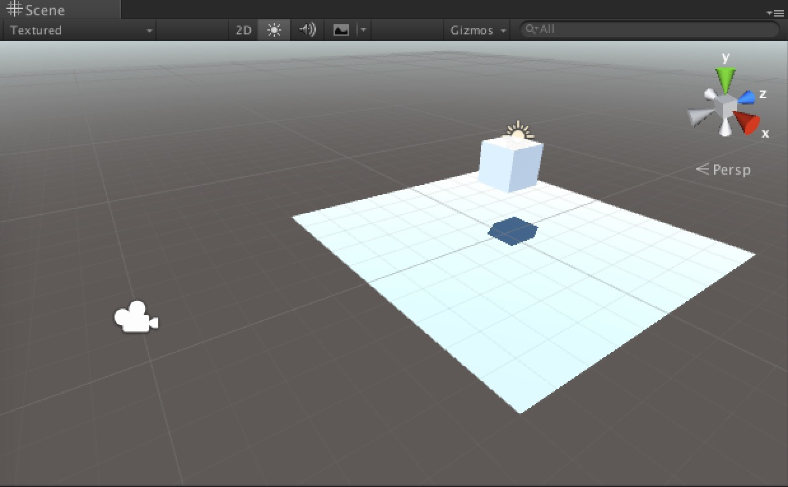
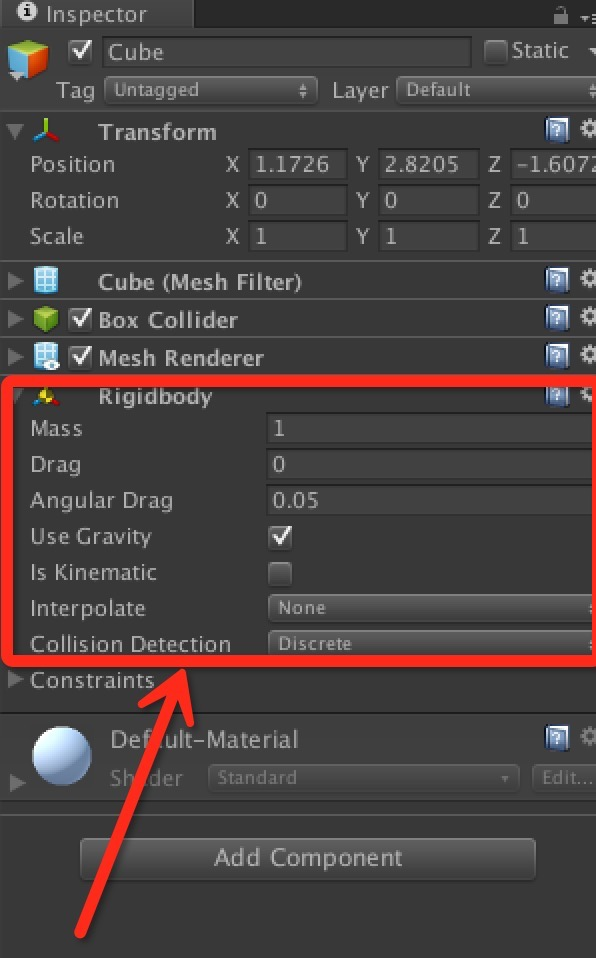

# Unity碰撞检测与触发检测

## 一、构建场景

在Unity里面，游戏物体的碰撞我们可以通过刚体组件（Rigidbody）和碰撞器组件（Collider）来进行检测。首先在场景里面添加一个Plane面板作为地面，然后在Plane面板的上方一定高度处放一个Cube立方体。

然后给Cube立方体添加一个刚体组件（Rigidbody）。运行游戏，这时候我们可以看到立方体掉在了面板上面。

## 二、碰撞检测

立方体和面板产生了碰撞，并且静止在面板上，这时候我们可以可以通过脚本来进行检测，比如立方体掉在面板上的时候我们可以将其销毁。给立方体添加一个检测碰撞的脚本组件CubeCollision，语言使用C#。代码如下：

	/**
	 *  Copyright (c) Clarence Zeng Binsi
	 * 
	 *      Author:     ZengBinsi
	 *      Date:       2016/01/25 16:10:28
	 *      Desc:       Collision test
	 */

	using UnityEngine;
	using System.Collections;

	public class CubeCollision : MonoBehaviour {

	    // Use this for initialization
	    void Start () {

	    }

	    // Update is called once per frame
	    void Update () {

	    }

	    // 碰撞开始
	    void OnCollisionEnter(Collision collision) {
	        // 销毁当前游戏物体
	        Destroy(this.gameObject);
	    }

	    // 碰撞结束
	    void OnCollisionExit(Collision collision) {

	    }

	    // 碰撞持续中
	    void OnCollisionStay(Collision collision) {

	    }

	}
	
在MonoBehaviour类中，OnCollisionEnter、OnCollisionExit和OnCollisionStay是碰撞时的回调方法，我们可以在CubeCollision类中重载它们。
 
 
*当绑定了CubeCollision脚本组件的游戏物体发生碰撞时，OnCollisionEnter便会被触发调用一次。然后，在整个碰撞过程中会持续调用OnCollisionStay方法，直到碰撞接触被解除时，OnCollisionExit被触发一次。*这是一个完整的碰撞接触过程，**这三个方法都有一个Collision类型的参数，用于保存碰撞信息**。
 
 
如果我们想要在当前脚本中去操作被立方体碰撞到的对象（面板），那么我们可以通过这三个方法的参数collision来获得被碰撞的游戏物体的碰撞器组件对象（collider）。然后通过collider对象可以得到碰撞器组件挂载的游戏物体的信息。

	// 碰撞开始
    void OnCollisionEnter(Collision collision) {
        var name = collision.collider.name;

        Debug.Log("Name is " + name);
    }
    
这样子就可以得到被碰撞的游戏物体的名称。

如果我们有很多游戏物体，名称各不相同，如果要检测某一类型的，我们可以通过给游戏对象设置Tag值来进行区分。我们给面板对象设置一个Tag值： 

然后修改代码为获取Tag值：

	// 碰撞开始
    void OnCollisionEnter(Collision collision) {
        var tag = collision.collider.tag;

        Debug.Log("Tag is " + tag);
    }
    
重新运行游戏：

## 二、接触检测

除了碰撞之外，Unity还支持接触检测。因为使用碰撞检测，发生碰撞的游戏物体之间会有碰撞模拟，比如撞到东西会反弹或者停顿一下之类的。有时候我们只是想要检测物体与物体之间是否发生接触，但是不要产生碰撞的效果，这时候我们可以使用触发器来进行接触检测。 

首先，我们把立方体Cube的碰撞器设置为触发类型：

像这样，我们在Cube的检查视图中找到碰撞器组件，将该组件的IsTrigger属性勾选上，这样在游戏物体发生接触的时候就不会有碰撞的效果了，而是会直接穿过去。Unity的碰撞器有很多类型，Cube的碰撞器类型是盒子碰撞器（BoxCollider），另外还有球形碰撞器、胶囊体碰撞器等。

然后，我们在CubeCollision脚本组件里面重载以下三个方法：
	
	// 开始接触
    void OnTriggerEnter(Collider collider) {
        Debug.Log("开始接触");
    }

    // 接触结束
    void OnTriggerExit(Collider collider) {
        Debug.Log("接触结束");
    }

    // 接触持续中
    void OnTriggerStay(Collider collider) {
        Debug.Log("接触持续中");
    }
    
MonoBehaviour类的OnTriggerEnter、OnTriggerExit和OnTriggerStay是触发检测的三个回调方法。

* **OnTriggerEnter**在游戏物体发生接触时调用一次。
* **OnTriggerExit**在游戏物体完全分离时调用一次。
* **OnTriggerStay**在游戏物体接触过程中持续调用。

**【值得注意的是，触发器回调的这三个方法的参数都是Collider类型，表示的就是被碰撞的游戏物体的触发器组件对象。】**

重新运行游戏，我们可以在控制台看到调试信息： 

这时候Cube会直接从Plane中穿下去，不会停在面板上。