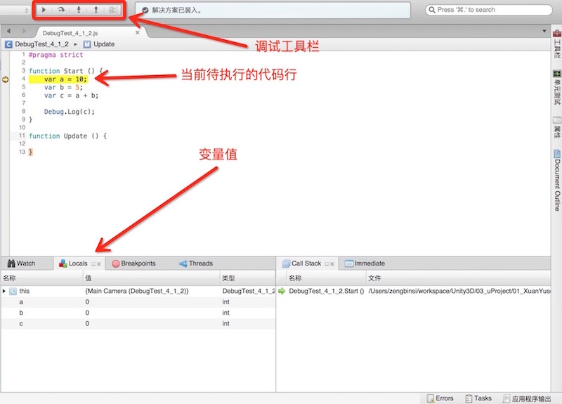

# Unity脚本调试

使用Unity自带的MonoDevelop编辑器可以方便的对Unity脚本代码进行调试。调试Unity脚本代码的步骤如下：

## 一、设置MonoDevelop脚本编辑器参数

1.1、打开MonoDevelop脚本编辑器，点击左上角的“MonoDevelop”，选择“Preferences”（首选项）菜单项。

1.2、在打开的“选项”窗口中，拉到最下面，选择“Unity”选项下的“Debugger”选项。

1.3、设置窗口中的“Editor Location”为“Unity.app”，Editor Location下拉列表设置的是调试时默认启动的引用程序。

1.4、勾选“Launch Unity automatically”前面的复选框，该选项表示是否启动调试。

1.5、勾选“Build project in MonoDevelop”前面的复选框，该选项表示是否在脚本编辑器中构建项目。

1.6、点击“确定”按钮，完成参数的设置。

**不同版本的Unity中，MonoDevelop的选项可能有所不同，但是基本都是差不多的，如果你的MonoDevelop选项窗口的选项有所不同，请自行查找对应选项进行设置。**

## 二、创建脚本

2.1、打开Unity，然后在Project视图中创建一个JavaScript脚本，命名为“DebugTest”。

2.2、在脚本的Start方法中添加如下代码：

	function Start()
	{
		var a = 10;
		var b = 5;
		var c = a + b;
		
		Debug.Log(c);
	}

2.3、保存脚本，然后将脚本挂载在摄像机对象上。

## 三、开始调试

3.1、在开始调试之前，我们需要设置断点，MonoDevelop编辑器设置断点的方式有两种：

（1）、在MonoDevelop中，将光标放置在需要添加断点的那一行代码的任意位置，然后选择MonoDevelop编辑器顶部菜单栏的“运行” --> “切换断点”，这时候代码前面就会出现一个圆点。
（2）、直接用鼠标左键点击代码左侧，同样可以设置断点。

如果要去除断点，同样只需要用鼠标左键单击那个圆点即可。

3.2、设置好断点之后，在MonoDevelop脚本编辑器顶部的菜单栏选择“运行” --> “Run With” --> “Unity Debugger”菜单项。这时候就开启了调试模式。

但是一个工程只能被一个Unity打开，所以如果出现以下错误提示，我们只需要关闭Unity编辑器，然后重复3.2的操作即可。

这时候，MonoDevelop会自动构建项目，然后打开Unity编辑器。在打开的Unity编辑器中，点击“运行游戏”按钮，程序便开始调试了。

通过MonoDevelop顶部的调试工具栏我们可以方便的控制代码执行调试，然后在Locals面部中实时看到代码运行的结果。
