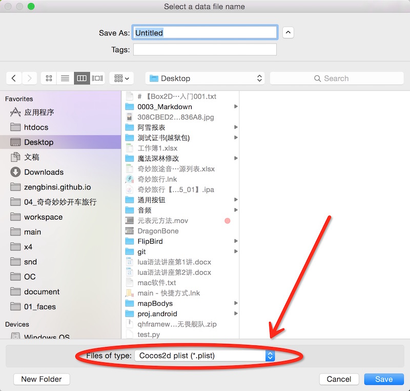
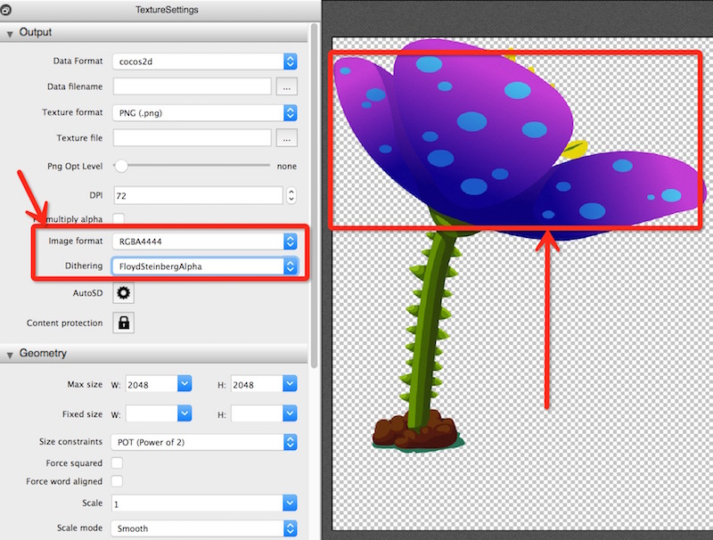

# Cocos2D手机游戏开发之优化篇

在这个手机游戏盛行已久的年代，一款产品想要博得更多用户的喜爱就要在细节上做得更加到位。而游戏的优化在这里面起到了非常关键的作用。试想下，一款画面和玩法都深受用户喜欢的产品，却只能在高端机子上面运行起来，或者就算运行起来也是各种卡顿、闪退，这样的结果相信不是任何一个游戏人愿意看到的局面吧。

相比于PC游戏，手游在内存上基本可以说是锱铢必较，一款非常普通的android机子想要运行一款稍微庞大点的游戏，内存的限制是非常苛刻的。所以，管理好内存的使用有时候也是衡量一名游戏人的重要标杆。

## 一、内存优化

在游戏中，占用内存最多的无非就是图片资源，所以如果可以从图片资源上面进行优化，那么得到的收益将会是最大的。

### 1.1、资源占用
首先，先来看一下一张 144X144 的图片在物理磁盘上面的占用的存储空间大概是30KB，但是使用Cocos2D游戏引擎加载到内存里面，它需要占用至少256KB的大小。

主要的原因有以下两个：

- *Cocos2D在像手机申请纹理图片内存的时候，只能将图片的宽高尺寸以2的n次幂大小来计算。*
- *Cocos2D默认的纹理深度是32位。*

对于第一点，**由于144并非是2的次幂数，与之相近的2的次幂数分别是128和256。如果使用128，那么申请到的内存空间显然无法存放 144X144 这么大的图片，那么只好使用256来进行计算，也就是Cocos2D会把它当成 256X256 大小的图片来申请空间，但是图片本身没有那么多数据，所以造成了内存空间的浪费。**

关于第二点，**Cocos2D使用32位的像素格式来保存像素信息，也就是图片上的一个像素需要占用32位(bit)。一个字节（byte）又等于8位（bit），所以一个像素需要占用4个字节（32 / 8）的大小。**

所以，可以轻易的得出 144X144 图片占用的内存为：

**【内存 ＝ 图片的宽 X 图片的高 X 4byte】**

也就是：

*256 X 256 X 4 = 262144 byte*

然后，**1KB ＝ 1024byte**，所以它占用的内存大概是256KB（262144 / 1024）。

### 1.2、合理利用内存

根据上面1.1提到的两点浪费内存的原因，我们就可以对症下药了。

对于图片尺寸导致的内存浪费问题，我们可以将很多小张的图片合成一张大张的纹理图，让大图的尺寸等于2的n次幂，这样我们就可以尽可能的去利用那些原先被浪费掉的内存。

合成大图的工具有很多，我个人比较推荐使用TexturePaker，这个工具有mac和win版本的，而且操作和界面布局基本一致。关于TexturePaker的用法，网络上面的教程很多，可以自行搜索。

这里要说的一点是Publish导出纹理集的时候要** 选择格式为“Cocos2d plist(*.plist)”格式  **，这样Cocos2D游戏引擎可以直接加载并解析。

不同的设备由于设备硬件的不同，可以加载的图片的最大尺寸也不同，所以我比较建议最大的纹理集尺寸为 2048X2048 ，这样可以保证在所有的主流设备上面都能够得到正确的加载。

### 1.3、修改像素格式

图片上面每个像素都有RGBA四个通道，RGB三个通道用于表示该像素的颜色值，A通道用于表示Alpha（透明）通道，每个通道默认使用8bit的内存来存储数据，所以总共是32bit。

32位的图片可以表示**16,777,216**种颜色，对于手机游戏，很多时候并不需要使用这么多种颜色，很多颜色肉眼也很难分辨出来。所以，32位的位图本身也挺浪费内存的，但是值得庆幸的是，Cocos2D允许开发者手动设置像素格式，代码如下：
	
	-- 设置像素格式为RGBA4444（16位）
	CCTexture2D:setDefaultAlphaPixelFormat(kCCTexture2DPixelFormat_RGBA4444)
	
【我使用的是quick-cocos2d-x，所以代码的语法都是lua的。】

Cocos2D游戏引擎支持的像素格式如下：

- kCCTexture2DPixelFormat_RGBA8888
- kCCTexture2DPixelFormat_RGBA4444
- kCCTexture2DPixelFormat_RGB5A1
- kCCTexture2DPixelFormat_RGB565

**【说明】：**

1、kCCTexture2DPixelFormat_RGBA8888：默认的32bit像素格式。

2、kCCTexture2DPixelFormat_RGBA4444：16bit像素格式，RGBA每个通道仅用4bit来存储数据，由于每个通道的内存减少了一半，所以能表示的颜色也会相应的变少。*如果可以，我一般都尽量使用这种格式。*

3、kCCTexture2DPixelFormat_RGB5A1：16bit像素格式，该格式分别使用5个bit的空间存储RGB颜色值，然后只用1bit表示透明值，所以它表示的颜色会比kCCTexture2DPixelFormat_RGBA4444更加的丰富，但是在透明度上只能表示全透明和不透明，无法表示半透明。

4、kCCTexture2DPixelFormat_RGB565：16bit像素格式，该格式将16bit都用于表示颜色，没有透明通道，所以没有办法表示透明像素，通常游戏的背景图可以设置成这样的格式。

除了上述四种格式之外，其实还有其它的像素格式，比如：8bit等，但是它们可能无法满足我们对游戏画面的需求，所以比较有用的就上述这几种。

**【注意】由于设置像素格式是对全局进行操作的，所以一旦修改纹理的像素格式之后，后面加载的纹理格式就全部变掉了，如果想要恢复32bit深度，需要再次进行设置。当然，已经被加载到内存中的纹理不受影响。**

## 二、渲染优化

游戏都是刷帧实现更新的，Cocos2D游戏引擎默认帧数是一秒钟60帧，也就是一秒钟要更新60次。但是设备的运算性能总是有限的，所以如果一帧之内的运算量过大，那么游戏更新一次的时间就会越久，一秒钟就无法达到60帧的更新速率，也就是我们常说的掉帧现象。对于Cocos2D游戏而言，一般帧率低于40帧，玩家就能明显的感觉游戏运行不流畅，画面卡顿。

### 2.1、批量渲染

Cocos2D在进行画面更新的时候，绘制一个精灵节点（CCSprite）需要通过如下三个操作：

**打开 -> 绘制纹理 -> 关闭**

那么如果一个场景里面有10000个精灵对象需要绘制，一帧的更新在渲染时候就要进行30000次（3*10000）完整的绘制操作。虽然手游很少会有一个场景里面10000个精灵的情况，但这无疑是一个要命的问题。

好在Cocos2D游戏引擎可以使用CCSpriteBatchNode来批量绘制精灵，创建CCSpriteBatchNode对象的代码如下：

	local  batchNode 	= CCSpriteBatchNode:create("node.png", 300)
	
创建CCSpriteBatchNode的时候需要两个参数，第一个参数是要批量绘制的精灵图片路径，第二参数是该CCSpriteBatchNode对象一次绘制的精灵个数【可以缺省】。

创建好CCSpriteBatchNode的实例对象后，就可以根据CCSpriteBatchNode的对象来创建精灵了，代码如下：

	local node 	= CCSprite:createWithTexture(batchNode:getTexture())
	
从CCSpriteBatchNode的实例对象中取得纹理对象，然后根据该纹理对象创建精灵。将创建的精灵添加到CCSpriteBatchNode对象上，然后将CCSpriteBatchNode实例对象添加到层（CCLayer）上面。这样，创建的精灵便会被显示在游戏场景中。

由于CCSpriteBatchNode使用的是同一份纹理，所以用它来进行批量绘制的操作如下：

**打开 -> 绘制纹理 -> 绘制纹理 -> ... -> 绘制纹理 -> 绘制纹理 -> 关闭**

使用CCSpriteBatchNode渲染10000个精灵还是需要进行10000次的绘制纹理操作，但是只需要打开和关闭一次，也就是省去了9999次的打开操作和9999次的关闭操作。

如果游戏开启FPS显示的话，明显的可以在左下角看到绘制次数从10000变成了1，而且帧率也会有所提升。

### 2.2、多纹理批量渲染

由于CCSpriteBatchNode创建的时候只能指定一张纹理图，所以在使用上面有一定的限制。比如有多个不同的纹理要进行批量绘制的时候，我们只好创建不同的CCSpriteBatchNode对象。

但是还有一种方法可以解决这种问题，那就是将多张需要批量绘制的纹理图片合成一张大的纹理图集。然后使用这张大图来进行创建CCSpriteBatchNode，这时候创建精灵会默认显示整张纹理，通过调用CCSprite的setTextureRect()方法，我们可以设置精灵只显示纹理的一部分区域。

### 2.3、图片格式

Cocos2D游戏引擎支持png和jpg格式的纹理图，但是比较推荐使用的是png格式。因为Cocos2D在加载jpg格式的纹理时，会实时转换成png格式。这表示加载jpg格式的纹理会比加载png格式的纹理要慢，并且转换的过程内存也会成倍的增加（3倍）。

### 2.4、其它方式

除了使用CCSpriteBatchNode来进行批量绘制外，如果在加载纹理时将像素格式设置为16bit深度的话，大概也可以提示10%左右的渲染性能。毕竟，处理32bit深度的位图需要更多的运算。

## 三、资源加载/卸载优化

### 3.1、资源加载

如果打开的游戏场景内部使用资源比较大，那么在构建场景的时候就需要读取更多的图片资源到内存中，IO操作本身就是一个耗时的操作，量大的话很容易导致游戏场景跳转时卡顿。

在场景构建时如果要读取比较多的资源，我们通常会添加一个loading（加载）场景，然后在loading场景里面做资源的加载操作，等资源全部都加载到内存中的时候，再跳转到需要打开的场景，访问内存空间的速度要远远高于访问磁盘空间的速度，所以这时候跳转场景就会很快速了。

很多程序员在进行资源预加载的时候经常出现程序崩溃的想象，有时候还会问为什么明明做了资源预加载，为什么一进入那个场景就闪退了。

闪退的原因有很多，比如：代码本身有bug、资源被释放导致的空指针、内存骤升等。

1、对于代码本身的bug，我只能说很遗憾慢慢去找吧，改掉就好。

2、资源被释放导致空指针问题，这个挺常见的，有时候两个场景有一部分资源是共用的，但是上一个场景结束的时候就给释放了，导致下一个场景要使用资源的时候方向是个空值（NULL）。对于这种情况，我们需要关注的是两个场景进行跳转时生命周期的回调顺序，在合适的地方进行释放应该问题就不大。

3、内存骤升，OS（操作系统）在发现某一个进程如果内存突然间急剧上升，很有可能会将该进程kill掉。

进程会被操作系统杀死，这种事情我们是无力回天了，但是我们可以搞清楚内存为什么会急剧上升。

Cocos2D在加载纹理图片的时候会先创建CCImage对象，然后根据CCImage对象去创建CCTexture2D纹理对象。所以，这个时候内存的开销是翻倍的。当创建好CCTexture2D纹理对象后，CCImage才开始释放。如果加载的纹理图片格式是jpg的话，由于需要进行格式转换，内存的开销就变成是三倍。

当我们在进行资源加载的时候，如果是一张接着一张的加载，有些CCImage对象没有及时的得到释放，内存淤积，这时候就会导致内存上升过快。一个有效的解决方案是在**加载完一张纹理后，延迟一两帧再加载下一张纹理。延长加载的时间间隔，让CCImage得到有效的释放，内存就不会上涨的那么快。**当然，加载的时间也会变得更长，我通常是延迟2帧，loading的时间总体上还是可以接受的。

### 3.2、资源卸载

进行资源卸载的时机是非常重要的，如果资源被占用，那么遍无法被有效的卸载掉，如果资源在使用前被卸载也很有可能导致空指针问题。通常我们可以在场景跳转的时候进行一次资源卸载，但是要等旧场景完全被释放后，新场景又创建结束之后进行资源卸载。这时候由于旧场景被释放了，占用的资源也可以得到有效的释放，新的场景又创建完毕，很少出现场景创建过程中读取纹理失败的问题。【要了解场景的生命周期】

### 3.3、分步加载/卸载

对于很多大型的游戏，由于游戏本身资源量太大，导致无法全部加载，这时候可以在合适的地方进行分步加载，这样游戏打开的速度便会得到有效的提升。同事，可以释放一些没有用的资源，合力的利用内存。

但是资源的加载和卸载比较是IO相关的操作，其本身就会耗费较多的性能。在进行加载和卸载的时候会影响到游戏的流畅度，所以在条件允许的情况下，能一次加载的绝不分多次加载，这样可以保证游戏的流畅度，增强体验感。

## 四、安装包大小优化

游戏安装包的大小很大程度上决定了游戏的下载量，除非这款游戏真的十分出色。

现在手机的移动流量费都非常的昂贵，每个月的套餐流量又十分的有限，虽然遍地有WIFI。但是包体越大，下载的时间就越久，手机游戏就跟快餐一样，都是闲暇时间玩个两三分钟的那种，如果游戏包很大，下载过程中可能就取消不玩了。

### 4.1、TinyPNG
在游戏开发完成后，我们可以使用[TinyPNG](https://tinypng.com/)等工具来进行图片文件的压缩。TinyPNG有PS插件和网页在线两种方案可供选择，PS插件需要收费，我们可以使用网页进行压图操作，网址是：https://tinypng.com/。

TinyPNG可以将图片压缩为原来的50%左右，压缩量非常可观，而且虽然是有损压缩，但是压缩后基本看不出来。

### 4.2、降低图片深度

说到这个，我们需要再次提到TexturePaker这款软件，TexturePaker可以轻易的将图片设置为16bit深度的格式。这样图片占用的空间也会减少一半。

但是使用16bit深度的图片格式来表示原本32bit的图片，很多颜色将会丢失，色值便会变成与之相近的另一种颜色。带有过渡色的图片便会出现明显的梯度。

如上图所示，可以明显的在花瓣上看到条纹状的颜色，这显然不是我们希望看到的事情。好在TexturePaker这个工具支持纹理震荡算法，我们可以在TexturePaker面板上设置Dithering属性为“FloydSteinbergAlpha”，这时候就可以看到纹理显示基本恢复正常了。

然后将图片导出，但是要注意的是这时候虽然纹理图片是16bit的，但是Cocos2D还是会默认将其当成32bit位图进行加载，除非手动修改纹理的像素格式。

