# 在mac上使用LDoc生成Lua的文档


如果下面操作出现无法执行lua代码的，需要先安装lua。详见第四点【[四、安装Lua](#installLua)】

## 一、安装LuaRocks

- 1.1、下载luarocks

	下载地址为：  
	[http://luarocks.org/releases/luarocks-2.2.1.tar.gz  ](http://luarocks.org/releases/luarocks-2.2.1.tar.gz  )  
	或者  
	[http://luarocks.org/releases/  ](http://luarocks.org/releases/  )
	
- 1.2、解压到本地磁盘
- 1.3、打开终端，进入luarocks根目录

```sh
	# cd luarocks本地磁盘目录
	# 例如
	cd /Users/zengbinsi/workspace/babybus/ldoc/env/luarocks-2.2.1 
```

-1.4、执行如下命令

```sh
	./configure
```
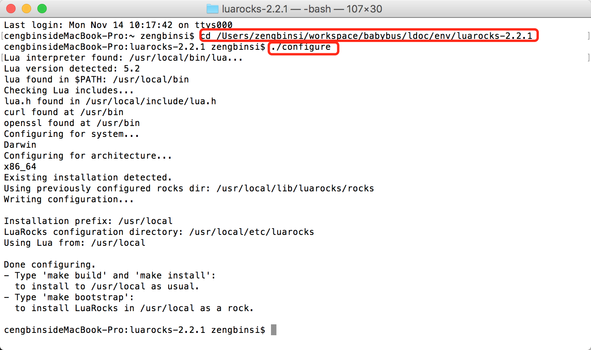  

-1.5、接着执行

```sh
	sudo make bootstrap
```

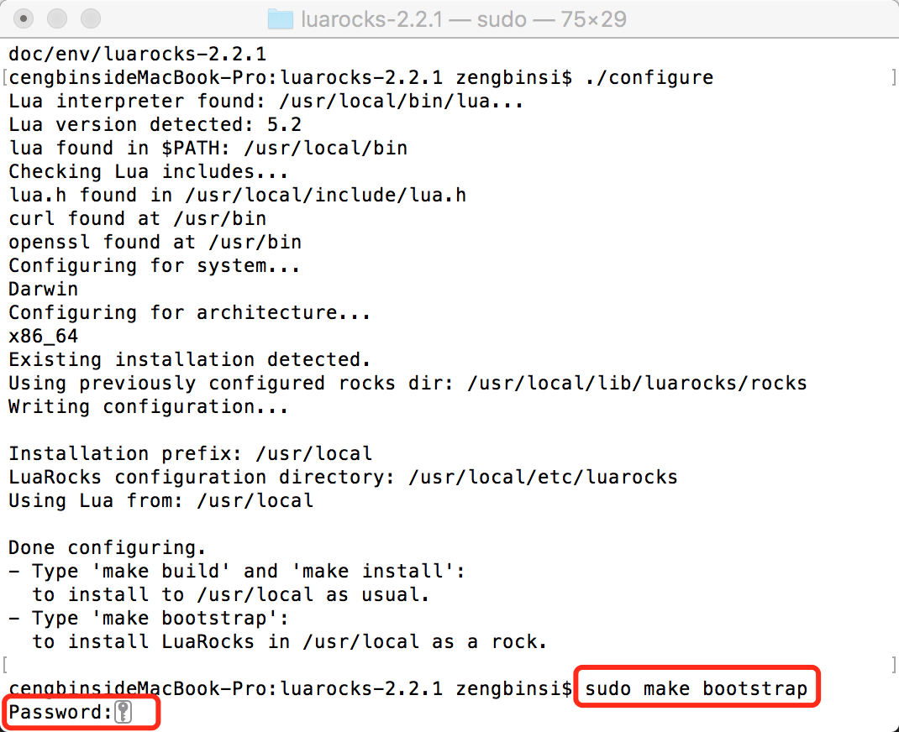  

因为使用了“sudo”指令，所以需要你输入电脑的密码。直接键盘输入回车即可（密码输入过程中控制台不会有任何字符的刷新）。

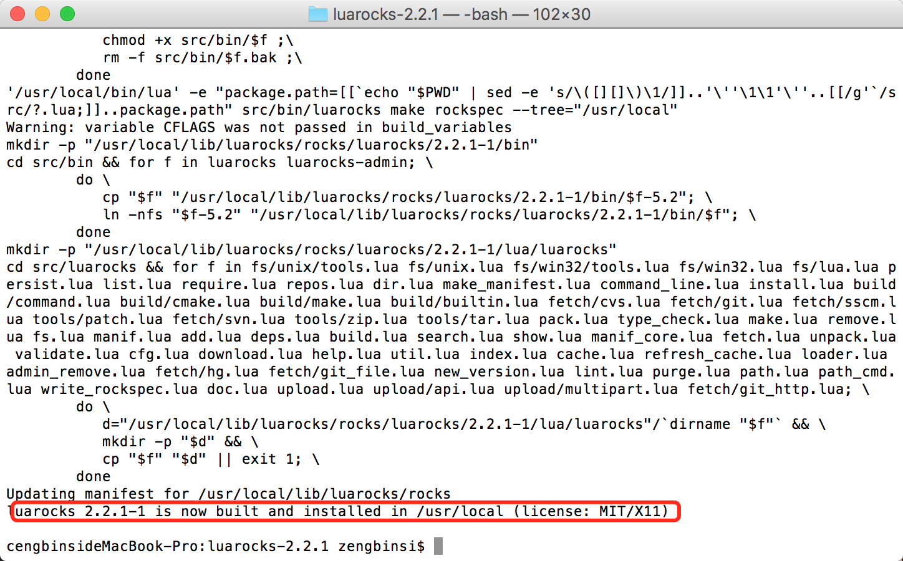 
直到安装结束为止。

- 1.6、测试luarocks是否安装成功  

在终端直接输入“luarocks”回车。终端会输出相关的说明就表示安装成功了。

 

## 二、安装LDoc

在终端输入：
```sh
luarocks install Ldoc -v
```

如果发现安装失败，就执行：

```sh
luarocks install Ldoc
```

如果提示如下错误：

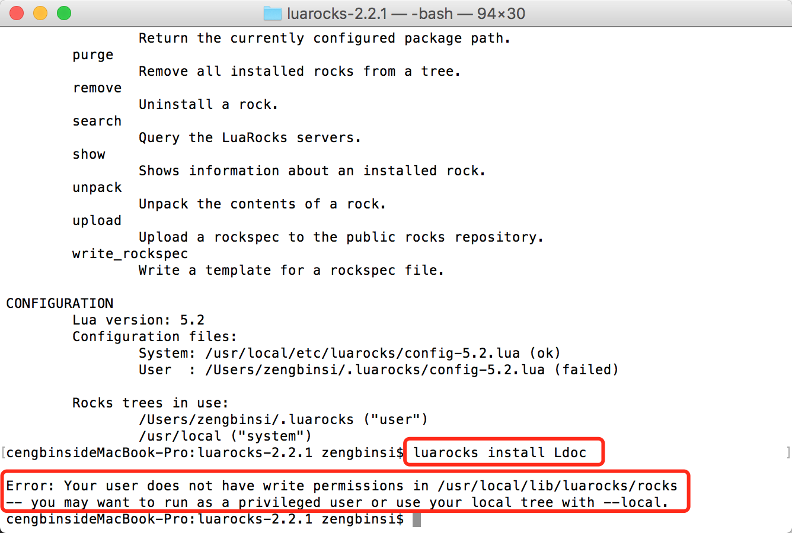 

这是因为命令权限不足，我们可以使用“sudo”指令来赋予权限：

```sh
sudo luarocks install Ldoc
```

这时候同样需要输入密码，然后回车，等待下载即可。

如果出现下载超时（timeout），可能是网络状态不好，重新执行即可。

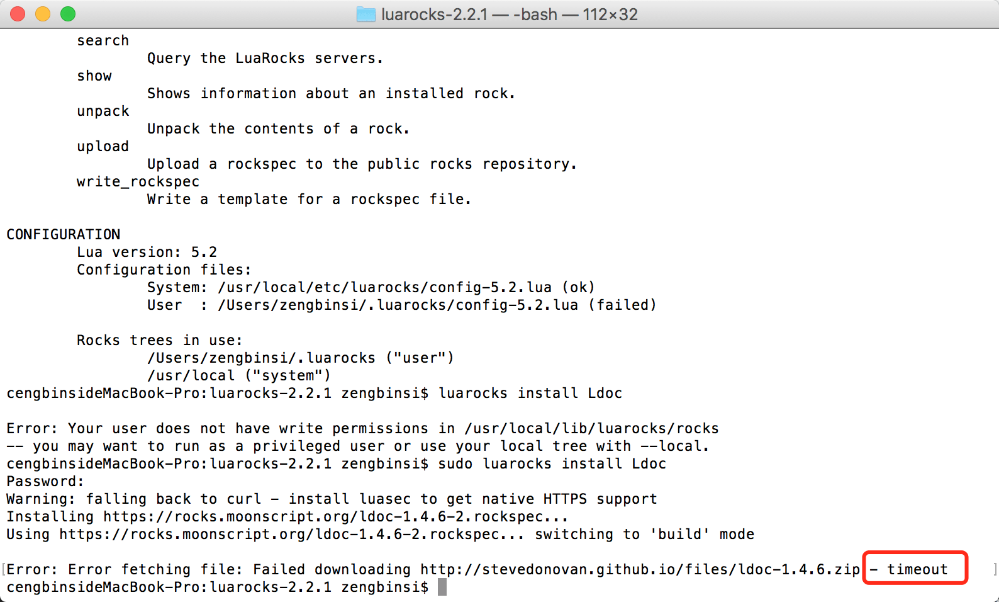 

安装好的模块会在“/usr/local/lib/luarocks/rocks”目录下。 我们可以通过open命令去看下里面的结构  

```sh
open /usr/local/lib/luarocks/rocks
```

当终端显示如下界面时表示安装成功：

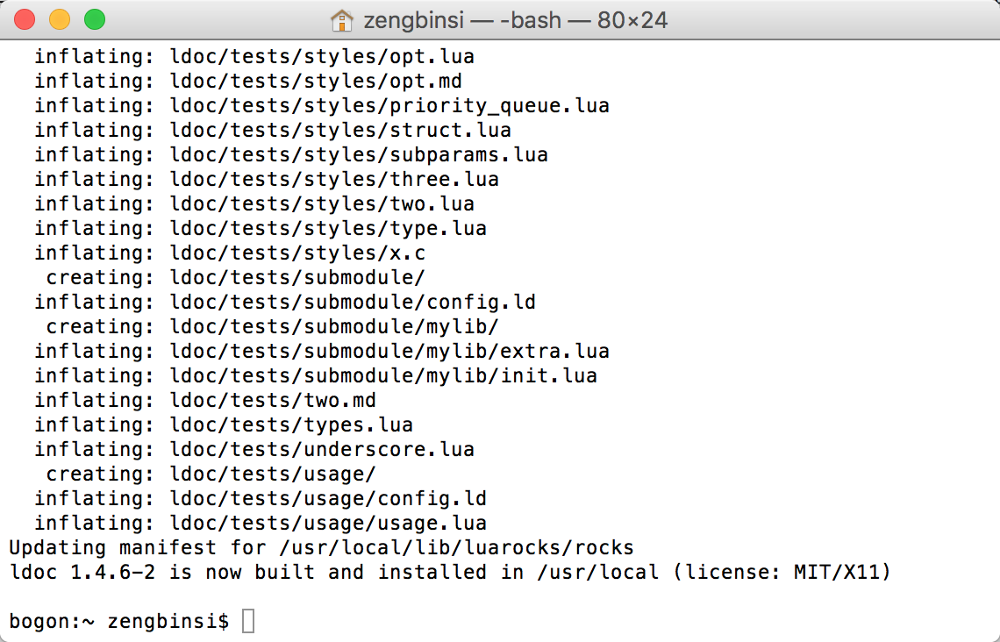 

## 三、使用LDoc生成文档

- 3.1、编写config.ld配置文件：

```
project='CStudio'
title='CStudio API'
description='这是一个关于CStudio的代码文档，方便后期维护，文档使用LDoc工具生成。'
format='discount'
backtick_references=false
file='./'
dir='./docs/API'
```

其中project表示项目的名称，title表示API文档的标题，description是一个说明。  
**重点关注file和dir。**

**file** ： 表示要生成文档的lua代码位置，相对于当前配置文件的目录，可以是文件，也可以是文件夹。  
**dir** ： 表示文档生成的位置，**相对于终端当前的目录**。（比如终端是/Users/zengbinsi/Desktop/ldoctest），那么上面这个配置文件最后导出的API文档目录为：/Users/zengbinsi/Desktop/ldoctest/docs/API。

- 3.2、将config.ld文件放在项目的跟目录。
- 3.3、打开终端，cd到要生成文档的目录。

```sh
# 例如
cd /Users/zengbinsi/workspace/babybus/ProjectSublime/wonderland3
```
- 3.4、终端运行ldoc指令：

```sh
ldoc /Users/zengbinsi/workspace/babybus/ProjectSublime/wonderland3
```
ldoc 后面的目录是config.ld所在的文件夹。

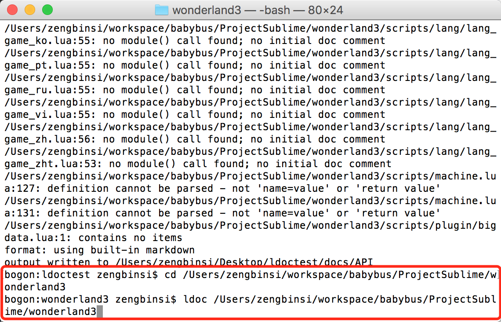 

- 3.5、生成成功

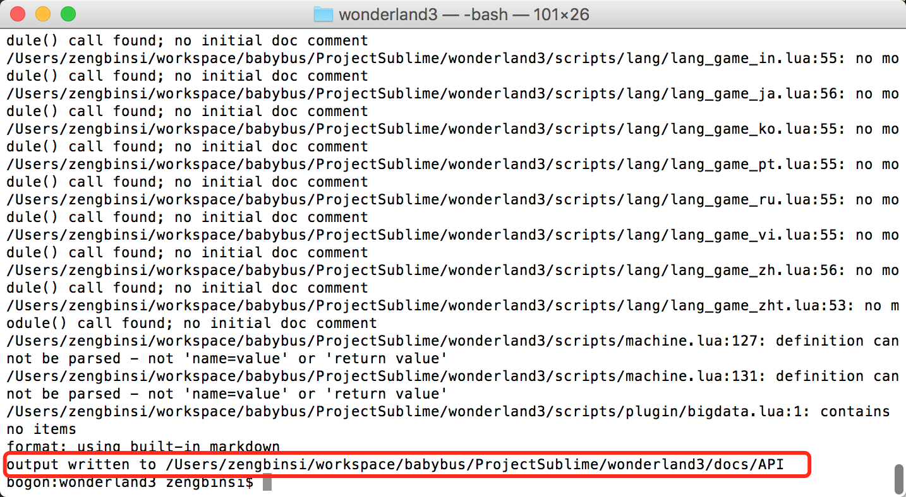 

生成成功的话，终端也会打印文档的输出目录。

- 3.6、生成效果

打开文档目录：

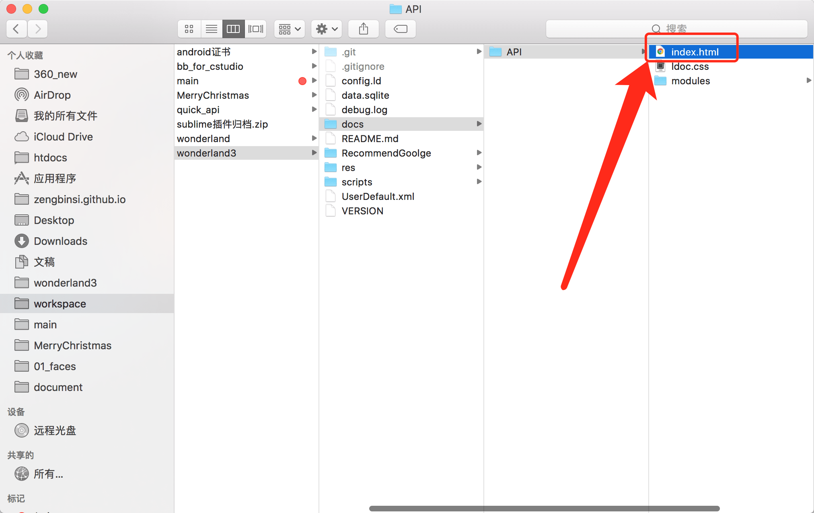 

找到index.html双击打开。

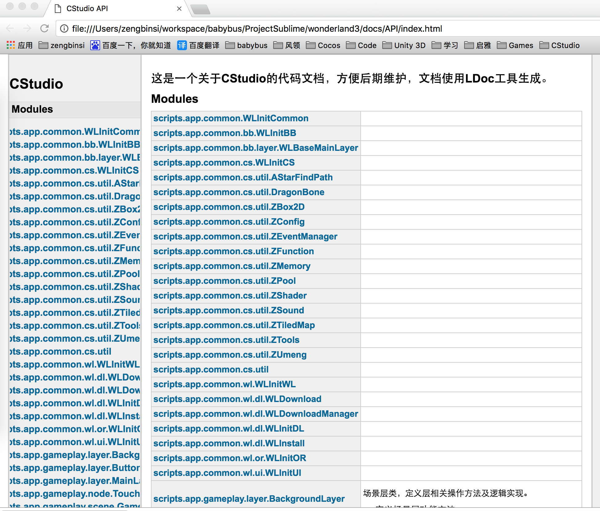 

**文档首页坐标的导航栏的选项有时候会很长，好在可以横向滑动**，我们可以通过鼠标滑到右边看是哪个文档（这个体验确实不好，应该用一个TreeView来做目录结构）。

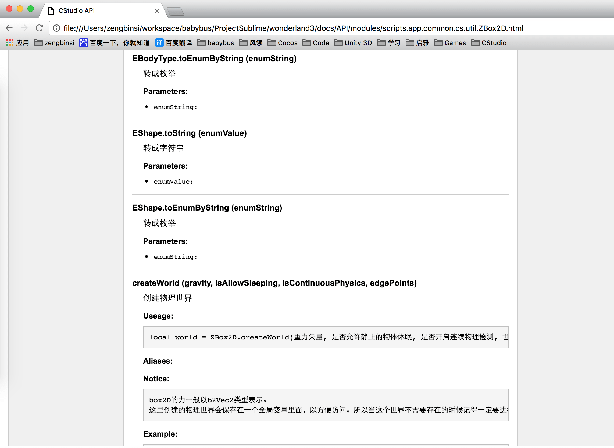 


*如果mac上无法执行lua命令的话，我们可以手动安装lua到mac上*

## 四、<span id="installLua">安装Lua</span>

1、下载lua安装包：[http://www.lua.org/ftp/](http://www.lua.org/ftp/)  
2、解压压缩包  
3、运行“终端”进入到该文件夹下。还是使用“cd 本地lua解压后的文件夹根目录”  
4、在“终端”执行：

```sh
make macosx 
``` 

5、在“终端”执行：

```sh
make test
``` 

正常情况下会出现： src/lua -v
Lua 5.2.0 Copyright(C)1994-2011 Lua.org,PUC-Rio  

6、再运行：

```sh
sudo make install
```

需要密码安装。

7、验证是否安装成功：

```sh
 lua -v
```

如果安装成功终端会打印“Lua 5.2.0  Copyright (C) 1994-2011 Lua.org, PUC-Rio”。


