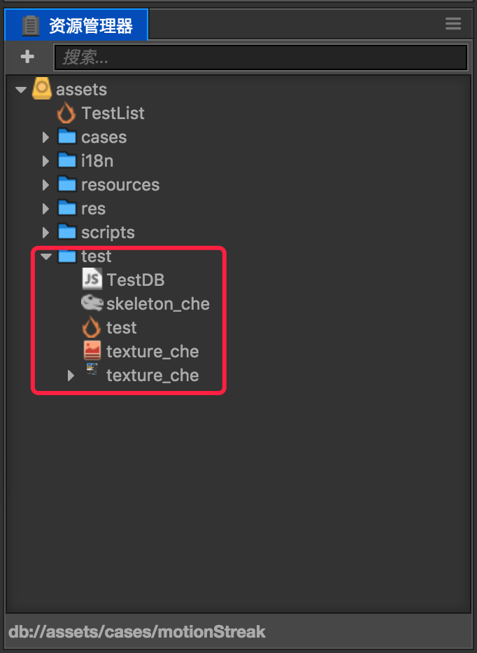
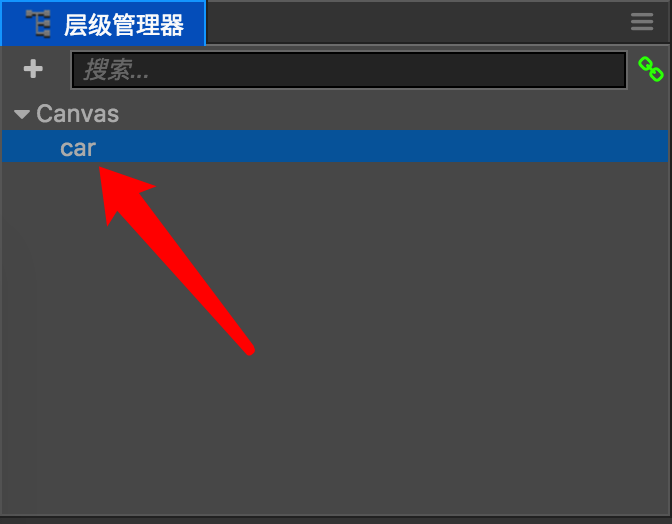
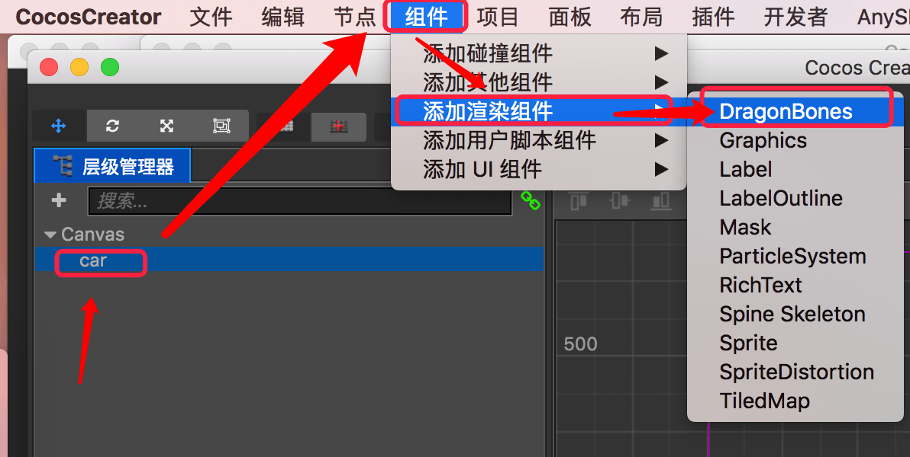
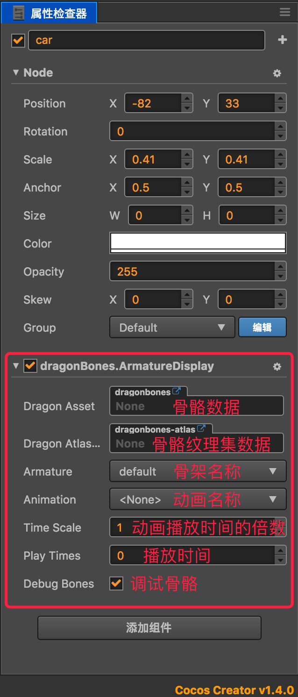
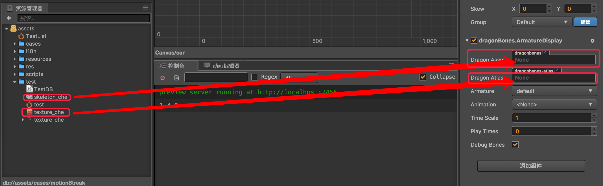
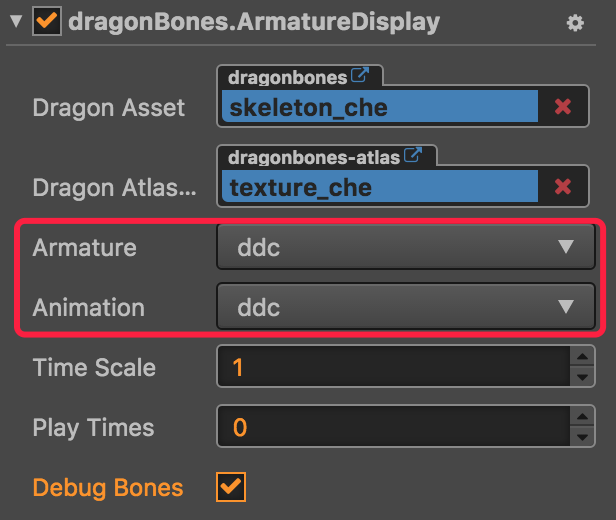
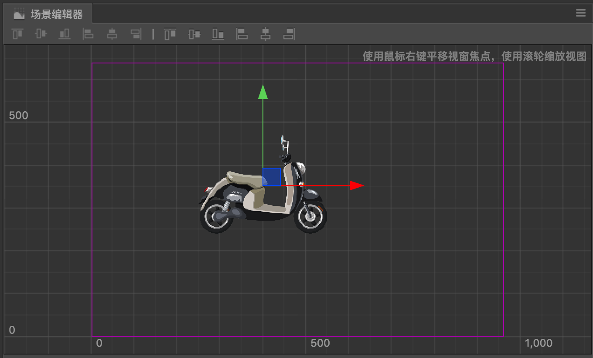
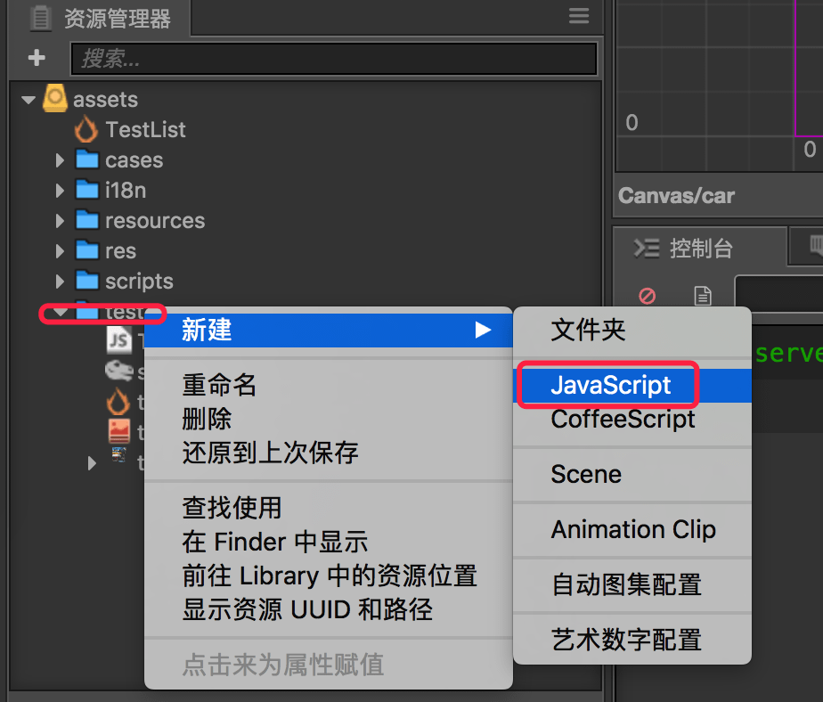
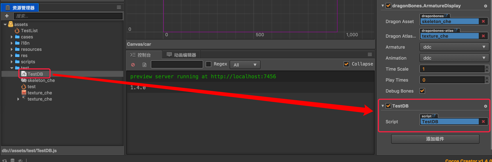

# CocosCreator操作DragonBones的骨头进行旋转

刚刚接触Cocos Creator（简称：ccc）不久，对于Creator还是比较陌生的。上上周有个朋友发了一个DragonBones的骨骼动画文件，说看能不能让里面的轮子转动起来。  

由于ccc和Unity3D都是组件化的编辑器，所以基本操作类似，我便直接开始去尝试。

## 一、导入资源文件



如上图所示，在资源管理器的assets文件夹下新建一个“test”文件夹，然后将DragonBones的三个资源文件拷贝到该目录下即可。

## 二、创建游戏对象



在游戏场景内添加一个空的节点，在层级管理器内将其拖拽成为Canvas的子节点，然后修改空节点的名称为“car”。

## 三、添加组件



在层级管理器内选中car，然后点击菜单栏的“组件->添加渲染组件->DragonBones”为car添加一个骨骼动画组件。



添加后可以在属性检测器面板上看到该组件。

## 四、绑定骨骼数据



将资源管理器中的骨骼数据和骨骼纹理集数据拖拽到属性检测器dragonBones.ArmatureDisplay组件的对应属性上松开即可完成绑定。



然后设置对应的Armature和Animation属性。



完成以上操作，DragonBones的骨骼动画就成功的显示在了场景编辑器面板中。

## 五、添加脚本组件



在资源管理器的test文件夹上右键“新建->JavaScript”创建一个脚本组件，并命名为“TestDB”。



将该脚本组件直接从资源管理器拖拽到属性检查器面板松开，完成组件绑定。

## 六、编辑脚本组件代码

双击资源管理器的“TestDB”组件，打开代码编辑器，修改代码如下：

```js

// use this for initialization
    onLoad: function () {
        // gjc mtc ddc slc  ssc  xc
        var name    = "ddc";
        // 获取组件对象
        var _armatureDisplay = this.getComponent(dragonBones.ArmatureDisplay);
        // 设置显示的骨架名称（其实已经在属性检查器面板上选择过了，这一步可省略）
        _armatureDisplay.armatureName = name;
        
        // ddc_luntai2  ddc_luntai1
        // 获取骨头对象（车子的后轮）
        this.ddc_luntai2 = _armatureDisplay.armature().getBone("ddc_luntai2");
        
        // 定义一个初始角度值
        this.angle = 1;
    },

    // called every frame, uncomment this function to activate update callback
    update: function (dt) {
    	// 角度值每次updata增加1
        this.angle = this.angle + 1;
        
        if (CC_JSB)
        {
        	// 在JSB环境下，设置骨头的角度，实现旋转
            this.ddc_luntai2.offset.setRotation(this.angle * Math.PI/180);
        }
        else
        {
        	// 在WEB环境下，设置骨头的角度，实现旋转
            this.ddc_luntai2.offset.rotation = this.angle * Math.PI/180;
        }
        
        // 获取组件，实现动画刷新显示
        this.getComponent(dragonBones.ArmatureDisplay).armature().invalidUpdate();
    },
    

```

完成编辑后，保存，然后运行即可看到效果。

由于官方文档不详细，特此记录。
