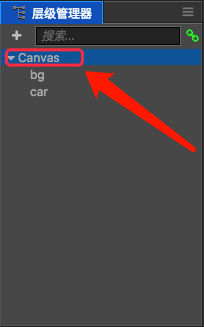
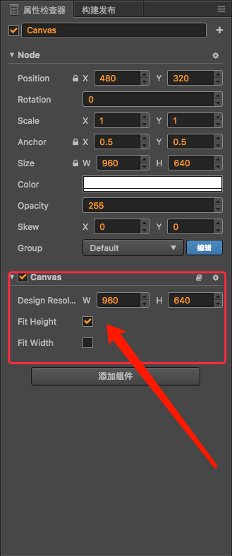
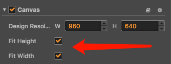
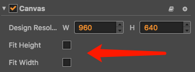
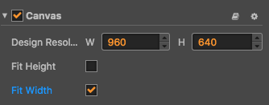

# Cocos Creator屏幕适配

本文主要讨论如果在Cocos Creator上实现不同的屏幕适配方案，补充官方文档的说明。  

## Cocos2d-JS屏幕适配

在Cocos2d-JS中，设计分辨率到设备分辨率的适配方案有5种，分别是：

- cc.ResolutionPolicy.EXACT_FIT  
- cc.ResolutionPolicy.SHOW_ALL  
- cc.ResolutionPolicy.NO_BORDER  
- cc.ResolutionPolicy.FIXED_HEIGHT  
- cc.ResolutionPolicy.FIXED_WIDTH  

关于这五种设计模式的具体效果网络上已经有非常多的博客介绍了，甚至自己写个代码测试下就知道了，这里就不再赘述。  

在Cocos2d-JS中设置适配方案的API是：

```js
// 设置适配模式
cc.view.setResolutionPolicy(cc.ResolutionPolicy.FIXED_HEIGHT);

// 设置设计分辨率尺寸和适配模式
cc.view,setSesignReolutionSize(960, 540, cc.ResolutionPolicy.FIXED_HEIGHT);

// 设置资源分辨率到设计分辨率的缩放比例
cc.director.setContentScaleFactor(1);
```

## Cocos Creator屏幕适配  

### 实现方式
**Creator的屏幕适配主要是放在Canvas组件上实现的**，所以每当创建一个新的场景时，默认都会有个一个Canvas对象在层级管理器上，**游戏内其它的节点都应该放在Canvas节点下**，这样才能有效的在web浏览器上进行适配。  

  


### Canvas组件
鼠标点选层级管理器上的Canvas对象，在属性检查器面板上会对应显示对象的组件信息。我们可以看到它默认添加了一个Canvas组件，并且勾选了“Fix Height”选项。

  

关于Canvas组件，主要有三个属性：  

- **Design Resolution**：主要设置游戏设计分辨率的尺寸，默认设置宽度960(W)高度640(H)。  
- **Fit Height**：固定高度。  
- **Fit Width**：固定宽度。  

### EXACT_FIT（非等比拉伸至全屏）

由于EXACT_FIT适配方案是将游戏内容非等比拉伸或缩放至全屏，实际效果通常都无法接受，所以在Creator中被废弃了，无法通过编辑器进行设置。如果非要使用，可以通过代码设置：

```js
// 设置适配模式
cc.view.setResolutionPolicy(cc.ResolutionPolicy.EXACT_FIT);
```  
但是可能会和Canvas冲突，所以可以试试禁用Canvas组件。这样处理后在web平台上可能会有问题，native上应该是可行的。  

### SHOW_ALL（等比显示整个场景内容）  



在Creator上同时勾选“Fit Height”和“Fit Width”即可开启showAll适配模式。  

这个适配方案其实也不是非常常见，我们公司早期都是使用这个方案。它的好处是不管屏幕比例如何，保证整个场景都是可见的，而且等比适配。但是总是在左右两边或者上下两边出现黑边。  

### NO_BORDER（等比拉伸到全屏）  

  

和SHOW_ALL相反，在Creator上同时去除“Fit Height”和“Fit Width”的勾选即可开启noBorder适配模式。  

这个适配模式是根据屏幕比例等比拉伸画面，有两种结果：  

- 当高度拉满，宽度超出屏幕的时候，裁切宽度。  
- 当宽度拉满，高度超出屏幕的时候，裁切高度。  

它的好处是没有黑边，缺点是在不同的屏幕比例上，不能缺点到底是宽度裁切还是高度裁切。所以进行场景设计的时候有挺大局限性。  


### FIXED_HEIGHT（等比拉伸高度到全屏）

  

由于手机屏幕的局限性，通常游戏设置为横屏的，在横屏模式下，通常设置适配方案为固定高度，所以这也是Creator默认的视频方案。  

在Creator中，只勾选Canvas组件的“Fit Height”即可开启fixedHeight适配模式。  

它的好处是可以实现全屏，拉伸或者缩放高度为屏幕高度，宽度进行裁切。

### FIXED_WIDTH（等比拉伸宽度到全屏）  

  

在Creator中，只勾选Canvas组件的“Fit Width”即可开启fixedWidth适配模式。  

它的好处是可以实现全屏，拉伸或者缩放宽度为屏幕宽度，高度进行裁切。在竖屏模式下，通常设置适配方案为固定宽度。  


