# DragonBones旧版本动画文件转新版动画

DragonBones(简称：DB)2.2版本的骨骼动画是早期Cocos2d-X游戏引擎默认支持的骨骼动画版本，但是DB的后续版本在数据格式上做了很大的调整，导致旧的游戏里面使用的骨骼动画无法在新工具或者新版本框架内无法使用。

## 动画制作

很多动画美术习惯使用flash进行动画的制作，DB官方提供了flash Pro插件，允许在flash内直接制作DB骨骼动画。 

- **DragonBonesPro和Flash Pro下载:**  [http://dragonbones.com/cn/download.html#.WQGlLBJ94mo](http://dragonbones.com/cn/download.html#.WQGlLBJ94mo)  

在这里可以下载到DragonBonesPro官方骨骼动画编辑工具和Flash Pro插件，建议美术直接在官方编辑工具上做骨骼动画。  

将下载好的Flash Pro插件安装到Flash中，然后就是动画的制作了。

- **DragonBones教程：** [http://developer.egret.com/cn/github/egret-docs/DB/dbPro/interface/mainInterface/index.html](http://developer.egret.com/cn/github/egret-docs/DB/dbPro/interface/mainInterface/index.html)  

## 动画导出  

在旧版本的Flash Pro插件中无法导出json格式的数据，在Cocos2d-X游戏中通常使用plist + png + xml格式的数据文件，其中png文件是骨骼动画的纹理图集，plist是关于png图片中的帧数据，用于切割图片和创建帧，xml文件里面是相关的动画数据。  

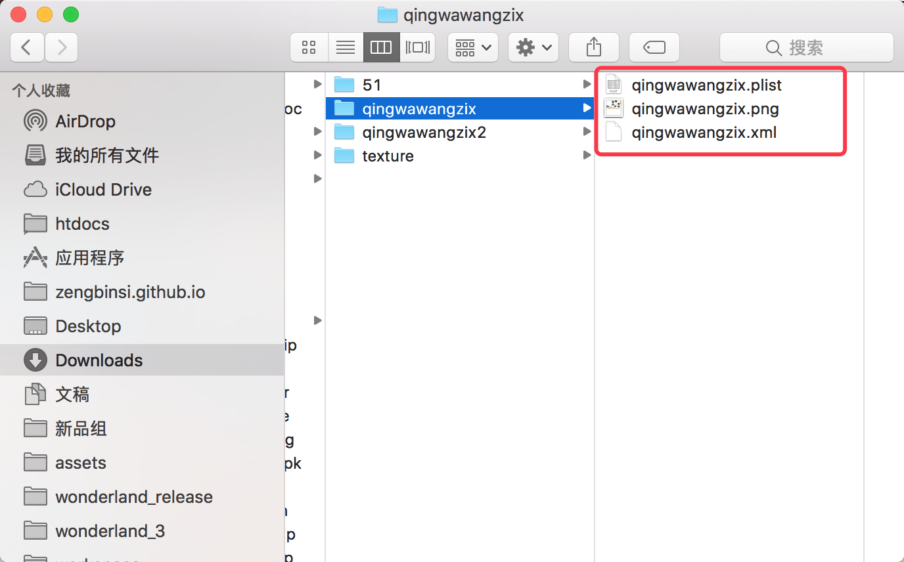

但是新的DB版本都是用json作为数据文件格式，并且DragonBonesInUnity也是使用json格式，对于plist + png + xml的资源无法进行使用，所以需要一些转换。  

## 旧版本转新版本  

因为DB官方已经放弃了早期的版本，所以DragonBonesPro无法导入早期版本的动画数据，所以这个转换过程有点麻烦，我们需要使用CocosStudio v1.6版本（简称：ccs）。  

### 1、下载CCS

- **Cocos Studio下载地址：** [https://github.com/fusijie/Cocos-Resource#cocos-studio-%E4%B8%8B%E8%BD%BD](https://github.com/fusijie/Cocos-Resource#cocos-studio-%E4%B8%8B%E8%BD%BD)  

由于Cocos官方已经废弃Cocos Studio这个非常尴尬的工具，所以从cocos官网已经无法下载到这个工具，在这里要感谢游戏大牛[傅思杰（厦门）的资源整合分享](https://github.com/fusijie/Cocos-Resource)以及github这个大社区（PS：希望这个链接不要失效）！ 

  

因为要用到ccs的动画编辑功能，所以必须下载windows版本的（貌似没找到1.6的mac版本）。  

### 2、解开plist和png的大图  

其实Flash Pro可以将纹理（图片）导出成大图（plist + png），也可以直接导出碎图，就是每个元件一张小图。如果是小图，通常没什么问题，如果是大图就需要解开了。

- **【mac】**  

在mac上我们可以使用TextureUnpacker进行碎图操作。  

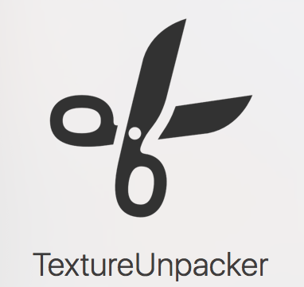  

- **【win】**

在win上可以参考[http://www.cnblogs.com/relvin/articles/5543612.html](http://www.cnblogs.com/relvin/articles/5543612.html)这篇博文的操作，或者自己网络上下类似的工具亦可。  

**【注意】**  
**碎图后，将所有的碎图放在一个名为“texture”的文件夹中，文件夹需要和骨骼动画的xml文件在同一个目录中，这样才能保证ccs可以正常导入。**

  

### 3、导入旧骨骼动画资源  

安装完ccs后，双击打开，然后选择“Animation Editor”打开ccs的动画编辑器。  

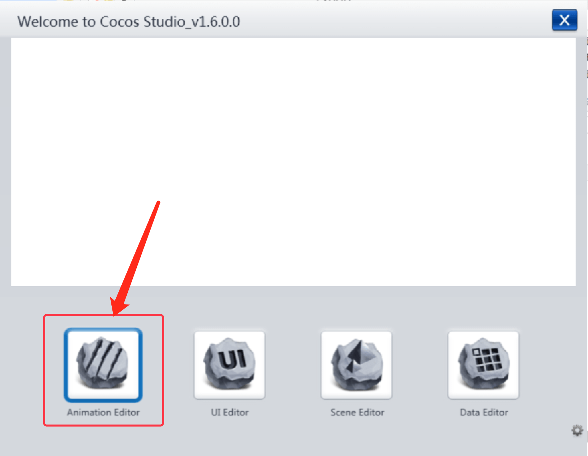  

打开编辑器后，在顶部的菜单栏中选择“文件 -> 打开Flash项目”  

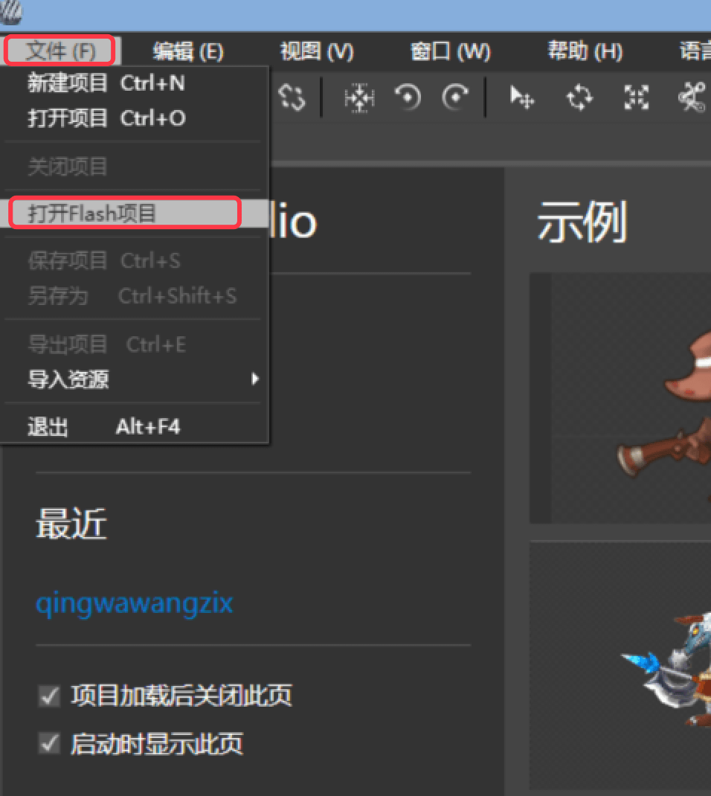  

在弹窗中，配置项目的名称和保存路径，点击“Flash”后面的“浏览”按钮，找到刚刚和碎图文件夹放在一起的xml文件，点击确定进行导入操作。  

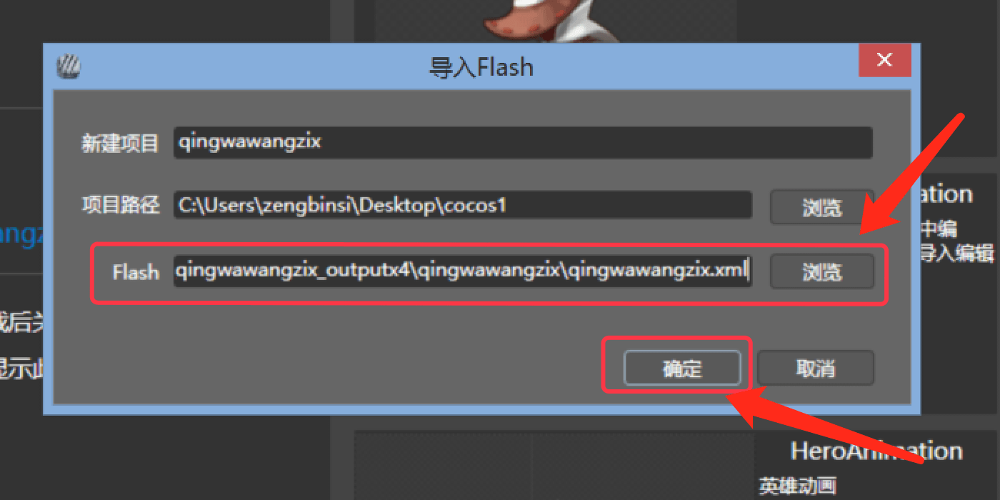  

如果导入过程中工具弹窗提示“未响应”火车“Cocos StudioAnimationEditor已停止工作”之类的，直接点击弹窗的“关闭程序”按钮，然后等待几秒钟即可加载完成，加载时间随动画的文件大小不同而不同。   

### 4、导出Cocos 1.x数据  

动画导入后，选择菜单栏“文件 -> 导出项目”进行导出操作：  

   

**【导出设置】**

- 图片最大宽度和高度一般选择2的幂次方数，不是所有的2的倍数都可以的。通常不超过4096，太大手机无法加载。
- 选择项目的导出位置，记住这个目录，到时候才知道文件导出到哪里。  
- 选择“导出全部大图”。 
- 点击“确定按钮”开始导出。  

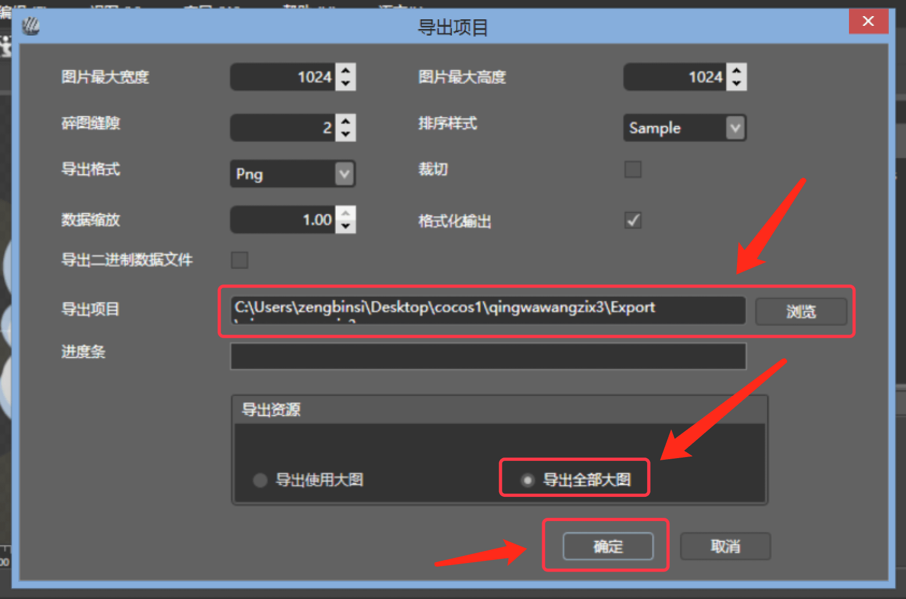  

项目导出后在项目里面有个“Export”文件夹，里面就是我们需要的Cocos 1.x骨骼动画文件。  

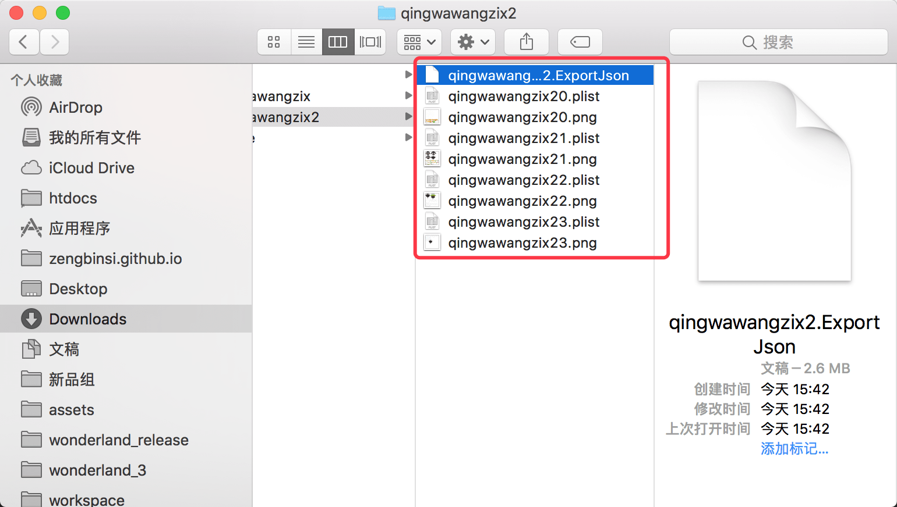  

其中ExportJson文件是动画数据文件，剩下的plist和png是纹理图片相关的文件。因为我们从ccs导出时设置了图片的最大宽度和高度，如果一张图无法放下所有的图片，就会导出多套plist + png图片。  

### 5、导入到DragonBonesPro中 

打开DragonBonesPro然后点击“导入项目数据”进行数据导入：    

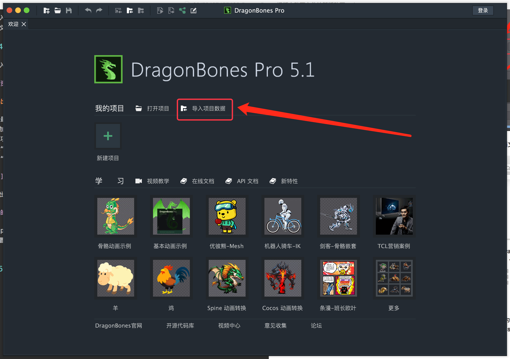  

在弹窗中点击“浏览...”按钮，选择刚刚ccs导出的“ExportJson”格式的文件。  

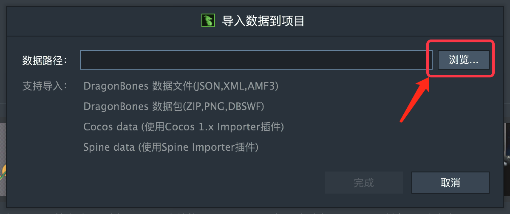  

点击“选择插件...”按钮选择“Cocos 1.x Importer”然后点击完成：  

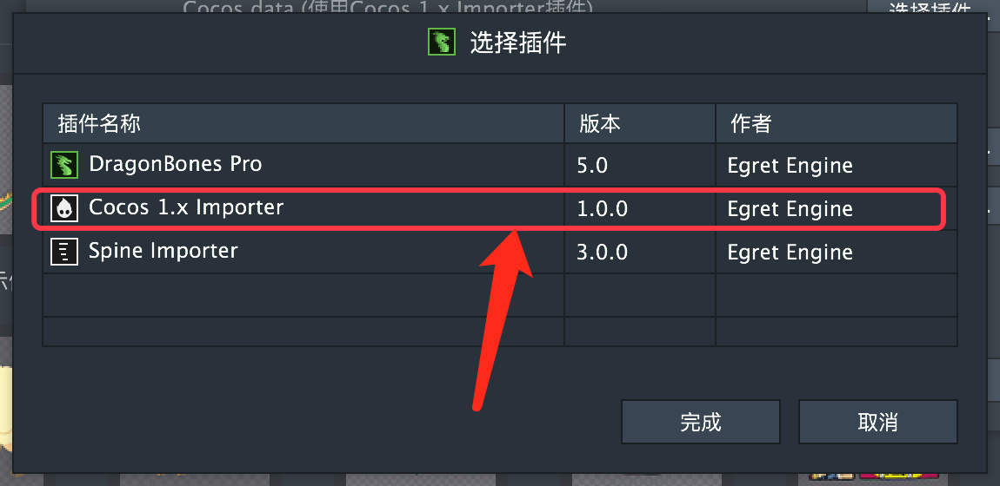

纹理集和配置文件默认只会加载一个文件，但是ccs导出的可能会有多个plist + png，这里我们需要点击对应的“浏览”按钮前面的“+”加号按钮将多有的文件都选中，例如下图：

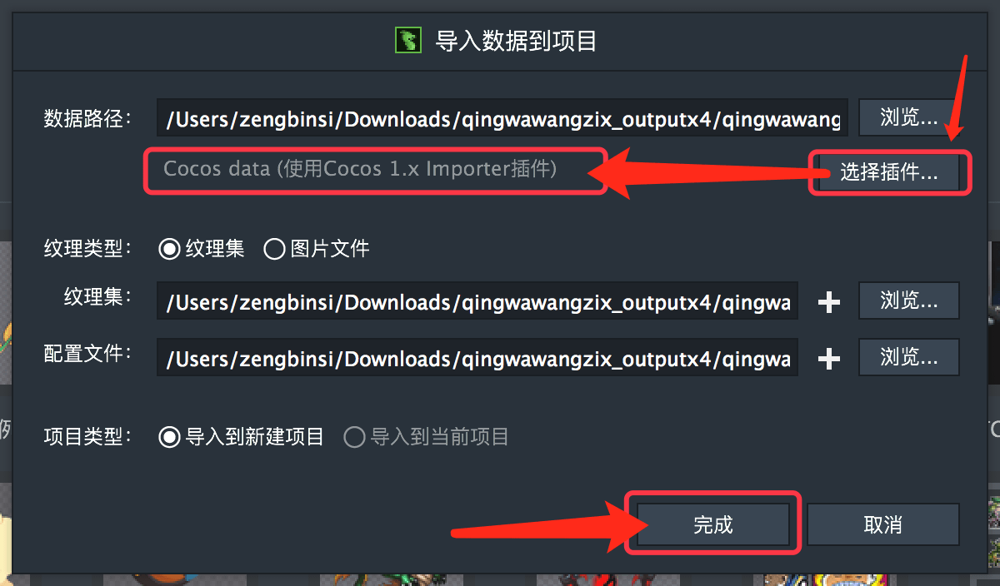 

所有都配置完成后，就可以进行导入操作了。

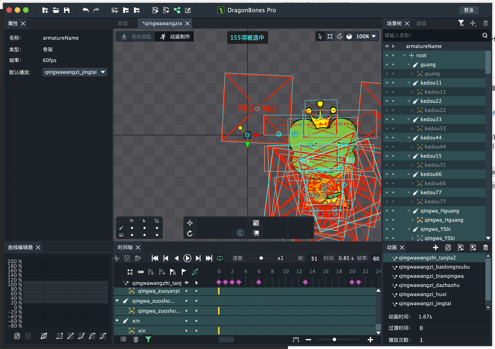  

完成上述操作，稍等一会儿即可在DB中显示出来了。  

### 6、导出新的DragonBones新版本数据  

点击DragonBonesPro顶部的工具栏的“导出项目(Cmd+E)”选项进行导出操作：  

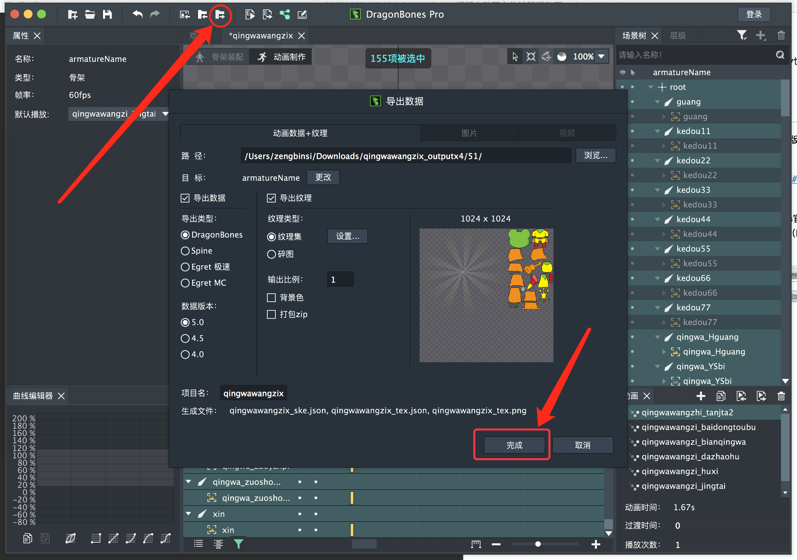  

在弹窗中注意导出的路径，我们可以选择“路 径”后面的“浏览...”按钮来选择一个保存导出文件的目录。  

在数据版本那边选择你最终需要的DB数据版本，然后点击“完成”按钮即可完成导出。  

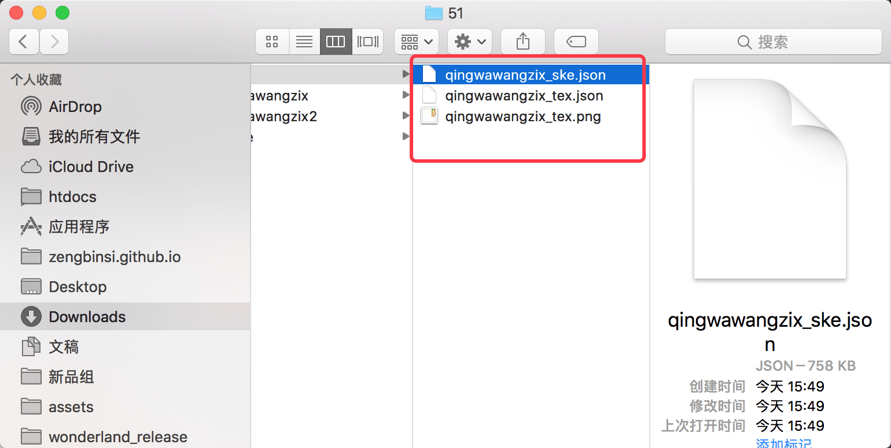  

这是一种万不得已的解决方案，我在mac上需要在windows和mac OSX两个系统间切换，过程稍微繁琐了点，在win上应该是可以接受的。当然最好是让美术在DragonBonesPro上制作骨骼动画，这样能最好的实现动画效果，方便跟随官方进行版本升级。  

