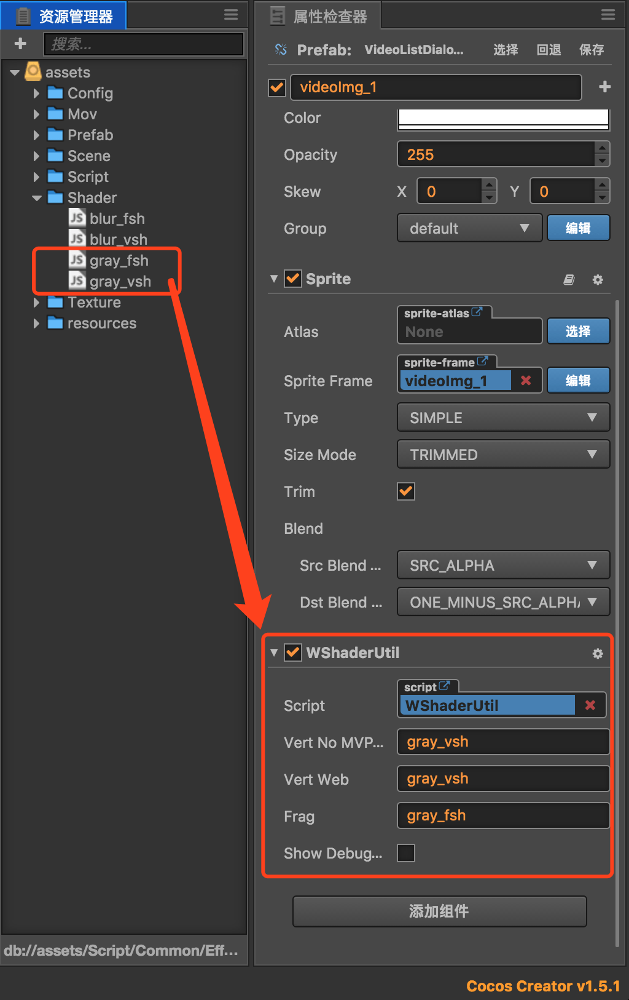
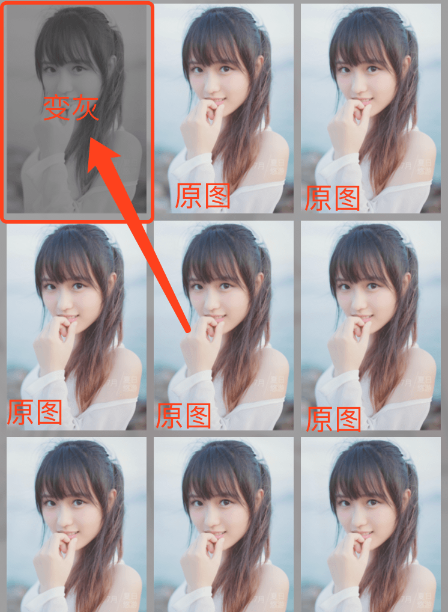

# Cocos Creator使用Shader

由于creator从1.5版本开始支持部分ES2015和TypeScript语法，所以我们的组件以ES2015的语法编写。

**【目前Creator还没有为Shader提供内置的特效组件，或者针对Creator Shader专门提供一些API，所以首先应该想到的是通过Cocos2d-JS来实现。理论上，任何creator现阶段没有提供的实现，我们都可以通过ccjs来曲线实现。】**

在Cocos2d-JS中的节点都对应在ccsg命名空间下，所以我们可以从渲染组件上获取ccsg节点对象，然后对其设置GL程序。

早前在Cocos论坛上看到一篇帖子有分享，一直很没有去看（懒-_-!!!）。前几天为了做一个高斯模糊，特地去看了下，它使用的也是这种方式。这是帖子的链接：

[http://forum.cocos.com/t/creator-shader/36388](http://forum.cocos.com/t/creator-shader/36388)

## 创建Shader组件
在项目的资源目录（Assets）下创建一个WShaderUtil.js文件，文件名随意。为了编码规范，这个文件内的组件类的类名也跟文件名一样。其代码如下：

```js
/**
* Shader特效组件
* zengbinsi
* 2017-06-28
**/
// 引入修饰器，以支持ES2015的语法
const {ccclass, property} = cc._decorator;

// var _default_vert_no_mvp = require('../../Shader/gray_vsh.js');
// var _default_vert = require('../../Shader/gray_vsh.js');
// var _black_white_frag = require('../../Shader/gray_fsh.js');

@ccclass
export default class WShaderUtil extends cc.Component {

    @property({
        type: cc.String,
        displayName: 'Vert No MVP Native',
        tooltip: 'native顶点着色器的代码模块名称（文件名），比如：gray_vsh。'
    })
    vert_no_mvp = '';

    @property({
        type: cc.String,
        displayName: 'Vert Web',
        tooltip: 'web顶点着色器的代码模块名称（文件名），比如：gray_vsh。'
    })
    vert = '';

    @property({
        type: cc.String,
        displayName: 'Frag',
        tooltip: '片元着色器的代码模块名称（文件名），比如：gray_fsh。'
    })
    frag = '';

    @property({
        type: cc.Boolean,
        displayName: 'Show Debug Logs',
        tooltip: '是否显示调试日志'
    })
    isShowDebugLogs = false;


    onLoad () {
        if (cc.sys.isNative) {
            if (this.frag === null || this.vert === null) {
                if (this.isShowDebugLogs) {cc.log('【WShaderUtil】vert or frag is null.');}
                return;
            }
        } else {
            if (this.frag === null || this.vert_no_mvp === null) {
                if (this.isShowDebugLogs) {cc.log('【WShaderUtil】vert or frag is null.');}
                return;
            }
        }
		
		// 取到ccsg.Node对象，这里我使用在精灵上，所以节点上必须挂载“cc.Sprite”组件
        this.glNode = this.getComponent('cc.Sprite')._sgNode;

        this.loadShaderCode();
        this.onInitGLProgram();
    }

    /**
     * 读取渲染程序代码
     */
    loadShaderCode () {
        // if (cc.sys.isNative) {
        //     this._default_vert_no_mvp = _default_vert_no_mvp;
        // } else {
        //     this._default_vert = _default_vert;
        // }
        // this._black_white_frag = _black_white_frag;

        if (this.isShowDebugLogs) {cc.log('【WShaderUtil】require GL code from module.');}
        if (cc.sys.isNative) {
            if (this.isShowDebugLogs) {cc.log('【WShaderUtil】require vert_no_mvp from module.');}
            this._default_vert_no_mvp = require(this.vert_no_mvp);
        } else {
            if (this.isShowDebugLogs) {cc.log('【WShaderUtil】require vert from module.');}
            this._default_vert = require(this.vert);
        }
        if (this.isShowDebugLogs) {cc.log('【WShaderUtil】require frag from module.');}
        this._black_white_frag = require(this.frag);
    }

    /**
     * 初始化GLProgram
     */
    onInitGLProgram () {
        if (this.isShowDebugLogs) {cc.log('【WShaderUtil】init GL Program.');}
        this._program = new cc.GLProgram();

        if (cc.sys.isNative) {
            if (this.isShowDebugLogs) {cc.log("【WShaderUtil】use native GLProgram");}
            this._program.initWithString(this._default_vert_no_mvp, this._black_white_frag);
            this._program.link();
            this._program.updateUniforms();
        } else {
            if (this.isShowDebugLogs) {cc.log("【WShaderUtil】use webGL GLProgram");}
            this._program.initWithVertexShaderByteArray(this._default_vert, this._black_white_frag);
            this._program.addAttribute(cc.macro.ATTRIBUTE_NAME_POSITION, cc.macro.VERTEX_ATTRIB_POSITION);
            this._program.addAttribute(cc.macro.ATTRIBUTE_NAME_COLOR, cc.macro.VERTEX_ATTRIB_COLOR);
            this._program.addAttribute(cc.macro.ATTRIBUTE_NAME_TEX_COORD, cc.macro.VERTEX_ATTRIB_TEX_COORDS);
            this._program.link();
            this._program.updateUniforms();
        }
        this.setProgram(this.glNode, this._program);
        if (this.isShowDebugLogs) {cc.log('【WShaderUtil】use GL Program success.');}
    }

    /**
     * 设置GLProgram
     * @param {ccsg.Node} sgNode 
     * @param {cc.GLProgram} glProgram 
     */
    setProgram (sgNode, glProgram) {
        if (this.isShowDebugLogs) {cc.log('【WShaderUtil】set GL Program.');}
        if (cc.sys.isNative) {
            var glProgram_state = cc.GLProgramState.getOrCreateWithGLProgram(glProgram);
            sgNode.setGLProgramState(glProgram_state);
        } else {
            sgNode.setShaderProgram(glProgram);    
        }
        
        var children = sgNode.children;
        if (!children) {
            return;
        }
    
        for (var i = 0; i < children.length; i++) {
            this.setProgram(children[i], glProgram);
        }
    }
}

```

了解Cocos2d-JS的开发者不难发现，其用法和ccjs原生几乎一致，只是稍微包装了一层，使其作用在_sgNode对象上。

## 编写Shader代码

shader代码使用GLSL进行编写，详细的这里就不说了，很多shader效果网上都有代码，我们随便找两个就是了。

### vsh顶点着色器

顶点着色器程序文件的后缀一般是“.vsh”的，但是为了方便使用，我们可以将GLSL代码以字符串的形式写在js文件中，然后GLProgram通过字符串进行初始化。

在资源目录下新建一个Shader文件夹用于存放GLSL代码，在该目录下创建一个名为“gray_vsh.js”的js文件，代码如下：

```js
/**
* 修改图片灰度的Shader代码
* zengbinsi
* 2017-06-28
**/

module.exports = 
`
attribute vec4 a_position;  
attribute vec2 a_texCoord;  
attribute vec4 a_color;  
                      
varying vec4 v_fragmentColor;  
varying vec2 v_texCoord;  
                                  
void main()   
{                             
    gl_Position = CC_PMatrix * a_position;  
    v_fragmentColor = a_color;  
    v_texCoord = a_texCoord;  
} 
`;
```

注意这里的字符串外层不是用单引号或者双引号，而是**使用键盘“tab”键上方的那个按键的小点（和波浪号同一个按键）**，js在这种引号中可以定义一个多行字符串。

### fsh片元着色器

片元着色器程序文件的格式一般是“.fsh”，我们在gray_vsh.js同目录下创建一个名为“gray_fsh.js”的js文件，用于编写片段着色器代码：

```js
/**
* 修改图片灰度的Shader代码
* zengbinsi
* 2017-06-28
**/

module.exports = 
`
varying vec4 v_fragmentColor;     
varying vec2 v_texCoord;      
          
void main()           
{  
    vec4 v_orColor = v_fragmentColor * texture2D(CC_Texture0, v_texCoord);  
    float gray = dot(v_orColor.rgb, vec3(0.299, 0.587, 0.114));  
    gl_FragColor = vec4(gray, gray, gray, v_orColor.a);  
}  
`;
```

## 使用组件



由于我给组件的几个属性设置的类型是字符串类型，而且Creator无法将除组件以外的js文件拖拽到属性检查器面板上进行绑定，所以这几个属性的值我都是手动输入的。

另外，Vert属性有两个，一个是web的一个是native的，一般情况下两个设置成一样的即可，这是为了解决web和native上GL代码出现不一样的解决方式。如果程序只运行在h5上，那么native的顶点着色器可以不进行设置。

**可以看到，这里设置组件属性的时候，填写的直接就是文件名（模块名称），连路径和文件格式都不需要，所以使用起来还是蛮方便的。**


## 效果预览



*【刚用Creator不久，这个工具确实很方便，现在就希望官方能够将滤镜等常用的特效封装成特效组件，方便更多的人。】*
