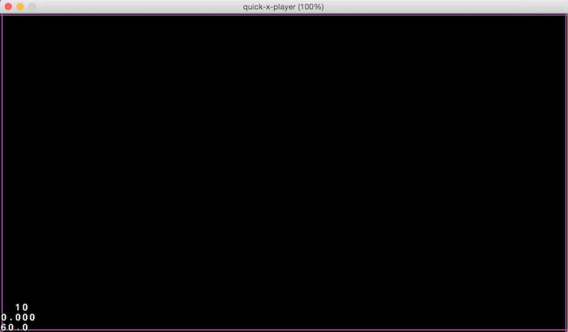

# 【Box2D】物理引擎入门001

## 一、什么是Box2D

Box2D是一个强大的开源物理游戏引擎，用来模拟2D刚体物体运动和碰撞，由Erin Catto早在2007年用C++语言开发。

Box2D集成了大量的物理力学和运动学的计算，并将物理模拟过程封装到类对象中，将对物体的操作，以简单友好的接口提供给开发者。我们只需要调用引擎中相应的对象或函数，就可以模拟现实生活中的*加速、减速、抛物线运动、万有引力、碰撞反弹*等等各种**真实的物理运动**。（引用百度百科）

**简单的说，Box2D就是一个物理刚体仿真库。**

## 二、如何学习使用Box2D

Box2D是一个**独立**的引擎框架，它的作用是帮助游戏开发者进行一些复杂的物理模拟运算，但是很多情况下它是作为某些游戏引擎的一个**子模块**存在的。所以，我们可以借助一些游戏引擎来进行学习。对于iPhone、iPad和Android游戏，可以使用Cocos2d游戏引擎和Corona Framework。

*关于原生Box2D的学习资料，网络上面是多如牛毛，博客的话在CSDN和博客园上面都有。书籍方面也有诸如《Box2D物理游戏编程初学者指南》之类的东西。至于这些教程写的到底好不好，这也只能仁者见仁，智者见智了。（反正我没看）*

我主要是基于bbframework框架开发游戏应用的时候使用到了这款出色的物理引擎，所以本文就在bbframework上进行介绍。

使用的工具：

- Sublime Text
- quick-x-player

关于bbframework(简称：bb)，它是基于quick-cocos2d-x框架的一个再封装框架，其核心应该可以说是cocos2d-Lua引擎（或者cocos2d-X）。而cocos2d其本身并不支持box2d物理引擎(cocos2d-JS除外)，所以目前在lua上的box2d接口都是公司通过lua绑定将原生的C++接口绑定到lua上的。**（难免有些API和C++原生不太一样）**

## 三、基本概念

Box2D物理引擎里面的所有类名都是以“b2”作为前缀的，以下是几个比较重要的类。

### 1、世界（b2World）

物理世界只是一个抽象的概念，可以将其理解成是一个盒子，盒子里面放的是各种个样的数学模型和物理模型（或者说就是N多的数学公式和物理公式），所有的物理模拟都在这个盒子内完成。

物理世界和cocos2d的渲染世界不同，渲染世界由场景、层和精灵等组成，在游戏运行时，渲染世界是可以看见（渲染显示）、可以摸到（绑定触摸事件）真实存在的。而物理世界的一切就跟万物的灵魂一样，看不见也摸不着，都是默默在后台运行的一些数据片段。

万物都是因为混沌初开，世界形成才存在的。同样，要使用物理引擎里面的东西，一切也都要从创建世界开始。代码如下：

		-- 创建世界
		local world = b2World(b2Vec2(0, -9.8))
		
		-- 允许静止的物体休眠
	    world:SetAllowSleeping(true)
	    -- 开启连续物理检测，使模拟更加的真实
	    world:SetContinuousPhysics(true)

创建世界可以通过调用b2World(gravity)函数进行创建，该函数的参数gravity是物理世界的重力加速度（g）。在物理学中，加速度是具有大小和方向的矢量，所以该参数可以使用二维向量来表示，其数据类型是b2Vec2，创建矢量可以直接调用b2Vec2(x, y)函数。

由于物理运算经常伴随着平方、立方、开平方和开立方，甚至是更高次的幂运算，所以其计算量是非常大的，对于性能的消耗也是非常可观。而游戏恰恰又非常强调运行的流畅性，所以很多时候当物体处于禁止状态的时候并不需要实时进行物理运算，这时候就可以将其从物理模拟中暂时的剔除出去，以提高整体的计算效率。**调用物理世界对象的SetAllowSleeping(isSleep)方法就可以设置世界内的物体是否在禁止的时候休眠，处于休眠状态的物体将不参与物理运算。**

同时，为了物理模拟的更加真实，通常还需要**开启物理世界的连续检测**。调用物理世界对象的SetContinuousPhysics(bool)方法便可以设置是否开启连续检测。（**连续检测会消耗一定的性能**）

世界非常的大，可以说是无边无际，然而游戏设备的屏幕是固定大小的，游戏的渲染画面也就那么大，所以为了保证物理模拟的物体处于可见的画面中，通常还需要给定一个边缘，用于表示物理模拟的世界大小，所有的物体都添加到这个边界里面。

物理世界里面的东西都可以看成是由刚体组成的，所以世界的边界我们也可以创建一个四边形刚体来表示，关于刚体的创建详见下文。

### 2、刚体（b2Body）

首先，要知道什么是刚体？以《愤怒的小鸟》这款游戏为例，小鸟在离开弹弓之后的运行状态完全是根据真实世界的物理效果进行变化的，那么在物理运算的时候，就需要一个刚体来表示小鸟（但**不是小鸟本身**），以参与物理运算。所以，刚体就是物理世界里面要进行物理模拟的物体。

在cocos2d中，你可以简单的把刚体当成是一个**数据对象**，这个对象里面包含了各种各样用于进行物理运算的数据（比如：质量、位置、旋转角度等）。

那么，什么样的东西适合在物理世界里面创建成刚体呢？物理世界简单的可以包含气体、液体和固体，Box2D是一个刚体仿真库，对于气体和液体的模拟并不是它的职责，所以**它适合模拟的东西只剩下固体了，而且是那种在物理模拟中不会发生形变的固体**（任何物体都会发生形变，这里只是一种理想状态）。

由于刚体是现实世界物体的一个仿真模拟，所以刚体也必须包含一些现实物体的物理属性，这些属性可以简单的称之为对刚体的描述或者是定义。所以在创建刚体之前，需要先创建该刚体的刚体描述，用来描述刚体的物理属性。

首先来看下Box2D原生对刚体描述的定义：

	b2BodyDef()
    {
    	// 用户数据
        userData = NULL;
        // 刚体位置
        position.Set(0.0f, 0.0f);
        // 刚体角度
        angle = 0.0f;
        // 刚体线性速度
        linearVelocity.Set(0.0f, 0.0f);
        // 刚体角速度
        angularVelocity = 0.0f;
        // 刚体线性阻尼
        linearDamping = 0.0f;
        // 刚体角度阻尼
        angularDamping = 0.0f;
        // 刚体是否可以进行休眠
        allowSleep = true;
        // 刚体初始状态是否处于唤醒状态
        awake = true;
        // 刚体是否固定旋转角度
        fixedRotation = false;
        // 刚体是否是一个快速移动的物体，为了防止发生击穿想象，开启它会增加处理时间
        bullet = false;
        // 刚体类型
        type = b2_staticBody;
        // 刚体是否处于活跃状态
        active = true;
        // 刚体所受重力加速度影响的倍数
        gravityScale = 1.0f;
    }
    
b2BodyDef是刚体描述的结构体类型，它可以包含以上14种物理信息。创建b2BodyDef的代码如下：

		local bodyDef           = b2BodyDef()
	    -- 类型：静态(b2_staticBody),平台(b2_kinematicBody),动态(b2_dynamicBody)
	    bodyDef.type            = b2_staticBody
	    bodyDef.position        = b2Vec2(0, 0)
	    bodyDef.angle           = math.rad(0)
	    -- 用户数据：存储用户的数据，可以是任何类型的数据。一般要求存储的数据的类型是一致的
	    bodyDef.userData        = nil 
	    bodyDef.angularDamping  = 0
	    bodyDef.linearDamping   = 0
	    bodyDef.fixedRotation   = false 

调用b2BodyDef()函数便可以创建一个刚体描述对象，然后我们可以随意设置一些描述信息（不设置的时候，它们都有默认值）。

这里有注意的是： 
	1、**刚体的类型：刚体类型分为静态刚体、平台刚体和动态刚体，对应值分别是：0、1和2。静态刚体是不受力的作用而进行移动的，用于模拟地面、墙面等禁止的物体；平台刚体可用于模拟游戏内的移动平台等物体，这些物体和地面等几乎一样，但是可以进行位置移动等；动态刚体是最常见的，所有会动的物体都创建为动态刚体。** 
	2、刚体的位置：在Box2D中可以使用b2Vec2类型的向量来表示坐标点。 
	3、刚体的角度：在Box2D中，刚体的角度是使用弧度制，并非和cocos2d一样的角度制。 
	4、**用户数据：用户数据用于保存一些程序员想要附加给刚体的信息，任何数据类型都可以，一般我们用于保存刚体对应的那个精灵节点对象（CCSprite）**。
	
创建完刚体的描述，就可以通过描述对象告诉物理世界需要创建一个什么样子的物体了。创建刚体的代码如下：

	-- 创建一个刚体对象，根据刚体定义创建
    local body = world:CreateBody(bodyDef)
    
通过调用物理世界对象的CreateBody(bodyDef)方法，物理世界就可以根据传递进去的bodyDef对象创建一个对应的刚体对象。

### 3、形状（b2Shap）

创建好的刚体其实只是一个包含一些物理量的一个质点（有质量但是没有大小的点），然而现实世界中的物体是有各种各样的大小和形状的，所以我们还需要为刚体创建对应的形状。（物体的碰撞模拟也需要借助于形状）

Box2D内置了以下几种简单形状：

- 链条（b2ChainShape）
- 圆形（b2CircleShape）
- 边线（b2EdgeShape）
- 多边形（b2PolygonShape）

除了以上几种之外，还可以借助PhysicsEditor等物理形状编辑器进行描点来创建更加复杂的形状。

在上文介绍世界的时候说到需要创建一个四边形当成物理世界的边界，那么这里可以选择用四条边首位相连，围成一个四边形。代码如下：

	local shape1         = b2EdgeShape()
    shape1:Set(b2Vec2(0 / 32, 0 / 32), b2Vec2(960 / 32, 0 / 32))
    local shape2         = b2EdgeShape()
    shape2:Set(b2Vec2(0 / 32, 0 / 32), b2Vec2(0 / 32, 540 / 32))
    local shape3         = b2EdgeShape()
    shape3:Set(b2Vec2(0 / 32, 540 / 32), b2Vec2(960 / 32, 540 / 32))
    local shape4         = b2EdgeShape()
    shape4:Set(b2Vec2(960 / 32, 0 / 32), b2Vec2(960 / 32, 540 / 32))
    
创建b2EdgeShape同样可以通过调用b2EdgeShape()函数来实现，然后调用b2EdgeShape对象的Set(fromPoint, toPoint)方法来指定边线的起点和终点。

这里我游戏的设计分辨率是 960 X 540 ，然后我创建的是一个和游戏设计分辨率同等尺寸的四边形，但是可以看到起点和终点的x、y坐标值都被我除以了32，这是因为Box2D使用的度量是以“米”为单位，而cocos2d的坐标系是以像素为单位的，通常设置其转换比例是1:32，也就是32像素的距离等价于Box2D中的1米，这样的模拟效果是比较好的。

### 4、夹具（b2Fixture）

创建好形状之后，需要将形状和对应的刚体进行绑定，这样刚体才能拥有形状。b2Fixture类就是用于见形状绑定到刚体上的，b2Fixture我们可以将其称为“夹具”或者“材质”。

在创建b2Fixture之前，也需要先创建对应的材质描述对象（b2FixtureDef），设定一些材质信息。材质描述的定义如下：

	b2FixtureDef()
    {
    	// 形状
        shape = NULL;
        // 用户数据
        userData = NULL;
        // 摩擦系数
        friction = 0.2f;
        // 恢复系数
        restitution = 0.0f;
        // 密度
        density = 0.0f;
        // 是否为传感器
        isSensor = false;
    }
    
材质信息中的形状和用户数据请参考上文，这里就不在赘述了。重点看下以下几个属性：

- 摩擦系数：用于影响刚体的运动，取值通常在区间[0, 1]，当然也可以更大。
- 恢复系数：或者称之为“弹性系数”，用于刚体碰撞后能量的损失计算。取值通常在区间[0, 1]，当然也可以更大。0表示发生非躺下碰撞，1表示发生完全弹性碰撞。
- 密度：密度通常用于计算刚体的质量，间接的影响刚体的惯性。
- 是否为传感器：当设置isSensor为true时，刚体发生碰撞的时候并**不会发生碰撞响应**（反弹），但是会接收到碰撞的信号，所以该属性可以理解为传感器。

同样，根据上面创建好的四条边来创建四个材质定义对象，代码如下：

	-- 创建材质描述
	local fixtureDef1    = b2FixtureDef()
    fixtureDef1.shape    = shape1
    local fixtureDef2    = b2FixtureDef()
    fixtureDef2.shape    = shape2
    local fixtureDef3    = b2FixtureDef()
    fixtureDef3.shape    = shape3
    local fixtureDef4    = b2FixtureDef()
    fixtureDef4.shape    = shape4
    
这里创建材质描述是调用b2FixtureDef()函数来实现，然后设置了描述对象的形状信息，其它的信息全部使用默认的即可。

有了材质描述，接下来就可以创建对应的夹具（材质）了，代码如下：
	
	-- 创建四个夹具
	body:CreateFixture(fixtureDef1)
    body:CreateFixture(fixtureDef2)
    body:CreateFixture(fixtureDef3)
    body:CreateFixture(fixtureDef4)
    
创建夹具的方法是调用刚体的CreateFixture(b2FixtureDef)方法来实现的，并且夹具会见材质上的信息与该刚体进行绑定，**一个刚体可以拥有多个夹具**。

## 四、物理调试（Debug）

上文说过，物理世界的一切都是看不见的，但是有时候为了方便排错，可以用其它的方法让物理模拟变得可见。

比如：我们创建好了一个刚体，我们想要知道刚体对应到cocos2d渲染世界里面的位置，那么我们可以在cocos2d渲染世界里面创建一个lable标签或者一个sprite精灵，并放到刚体的位置上面，这样我们就等同于是让刚体可见了。而对于边线、圆之类的刚体形状，我们可以使用一些游戏引擎的绘图API在渲染世界内对应的进行绘制，这样形状也可以看到了。很多时候将这些数据进行可视化会帮助游戏开发者更好的进行物理排错。

在bbframework中，可以使用以下代码进行物理的可视化操作：

	local debugDraw = GB2DebugDrawLayer:create(world, 32)
    self:add(debugDraw, 9999)
    
GB2DebugDrawLayer这个类专门用于负责物理对象的可视化模拟，调用该类的create(b2World, PTM_RATIO)方法进行构造时，需要传入物理世界对象和cocos2d与Box2D的度量单位比例（像素/米）。然后将GB2DebugDrawLayer的实例对象添加到当前场景的Layer上。

这样我们便可以在渲染世界里面看到物理模拟的效果了。

如上图所示，我们可以看到屏幕的边缘有红色或者绿色的边线，那就是上面创建的世界边缘的四条边。

由于篇幅过长，关于自定义形状和Box2D关节以及接触检测留在下一篇介绍。

