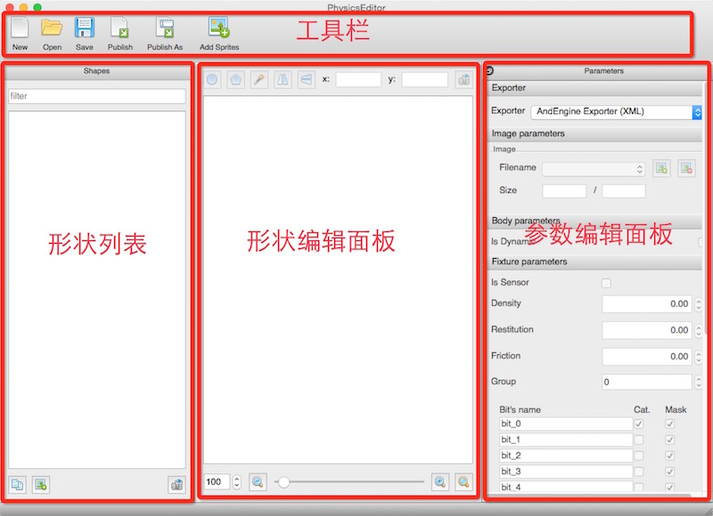
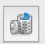
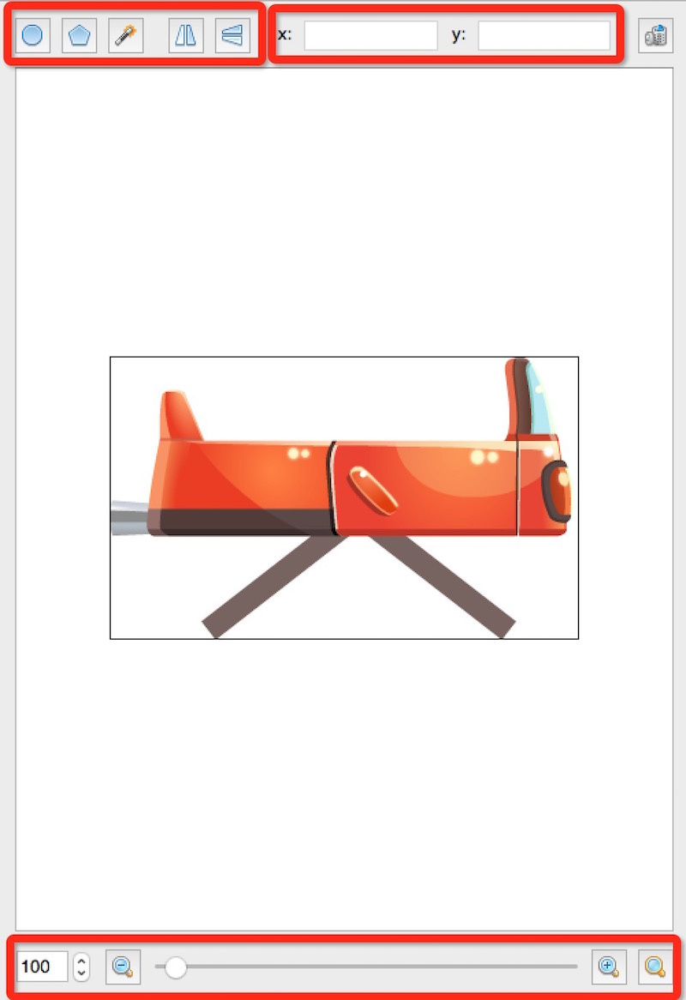
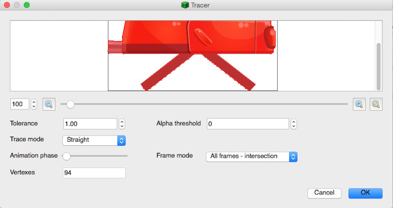
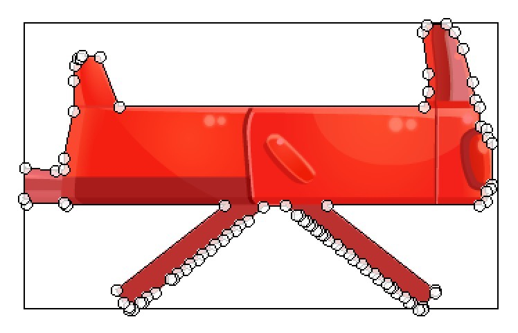
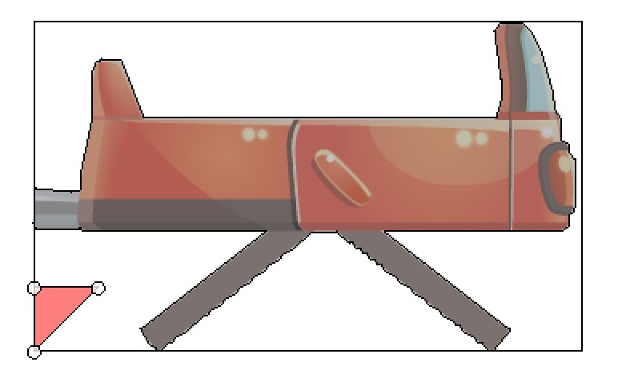
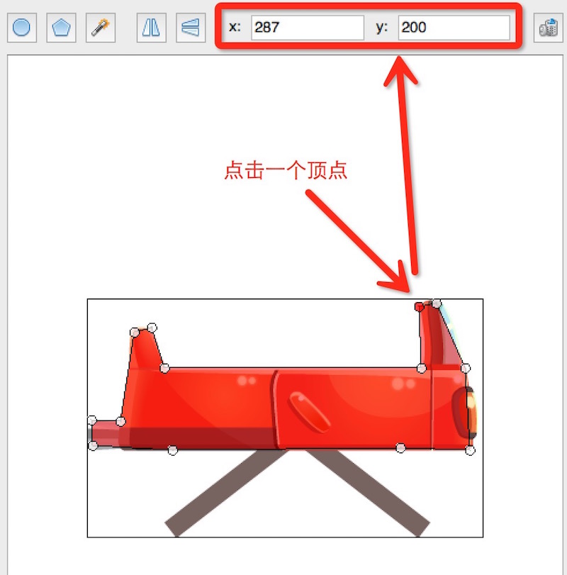

# 【Box2D】物理引擎入门002

## 物理编辑器篇（PhysicsEditor）

在Box2D中，除了可以使用内置的几种基本形状之外，它还支持从外部文件中进行材质（b2Fixture）的创建。在创建一些复杂的刚体形状时，单纯的使用多边形描点是一个比较费劲的工作，这时候借助PhysicsEditor这款出色的物理材质编辑器来进行可视化编辑会大大提高效率。

### 一、形状编辑

如上图所示，PhysicsEditor的主界面大致分为四个区域*（工具栏、形状列表、形状编辑面板和参数编辑面板）*。

#### 1、工具栏（ToolsBar）

工具栏位于界面的**顶部**（如果Windows版本的话，在工具栏上方还有有一行菜单栏），工具栏从左往右依次包含以下6个工具项。

- New：新建文件。
- Open：打开一个已有的物理材质编辑文件。
- Save：保存当前的编辑文件。
- Publish：导出配置文件。
- Publish As：导出所有。
- Add Sprites：添加精灵。

#### 2、形状列表（Shapes）

形状列表的面板默认在主界面的左边位置，该面板显示的是文件编辑的形状。为了方便编辑形状，开发者可以直接将要编辑的形状对应的图片拖进该面板松开。

如果要删除某个形状，只需要在Shapes面板上面选中要删除的形状，然后点击面板右下角的删除按钮（）即可。**（图片的名字会默认为形状的名称，以便导出到文件最后在代码里面使用，所以一般使用合法标识符对图片命名。）**

#### 3、形状编辑面板（Editor）

主界面中央是用于编辑形状的面板，选中Shapes面板上面的形状后，该面板会显示对应的图片，开发者可以根据图片的轮廓进行描点，编辑出想要的形状。

形状编辑面板的顶部是一组形状编辑工具，从左往右依次是：**圆形、多边形、魔术棒、左右对称、上下对称、顶点的x坐标值、顶点的y坐标值和一个删除按钮**。

##### 3.1、魔术棒

在形状列表里面选择一个形状（我这里的carBody_1），这样便可以编辑carBody_1的形状了。先从魔术棒开始吧，点击魔术棒之后，编辑器会弹窗(*如上图*)显示自动描绘的形状顶点，直接点击右下角的“OK”按钮。物理编辑器根据图片的像素点自动生成了一个多边形（*如下图*）。

##### 3.2、多边形

虽然编辑器可以使用魔术棒自动生成多边形，但是这样形成的**多边形顶点个数太多，会影响物理模拟的性能**（计算量增加了），所以对于多边形，通常建议开发者使用多边形手动编辑（不用太过精确）。

点击多边形按钮，我们可以看到多生成了一个三角形（多边形默认为三角形），如下图：

新建形状后，原本使用魔术棒生成的形状会变灰掉，开发者可以点击灰掉的形状（形状变成红色选中状态），然后点击编辑面板右上角的删除按钮（*y值右边的那个按钮*）去除不要的形状。

生成的多边形默认在图片的左下角位置，开发者可以手动将其拖拽到合适的位置。然后，可以在形状相应的边线附近双击添加一个顶点（也可以右键创建一个顶点）。

编辑好形状之后，可以选中一个顶点，然后顶部的x和y后面的文本框就会现实该顶点的坐标值，开发者可以手动输入进行微调（如上图）。

##### 3.3、圆形

在形状列表选择wheel_1，然后点击形状编辑面板顶部的圆形按钮，这样就可以创建一个圆的形状。圆形在形状右边（*3点钟位置*）有一个顶点，拖拽它便可以调整圆形的大小。

##### 3.4、形状镜像显示

如果要把编辑好的形状变成它的左右翻转镜像或者上下翻转的镜像，只需要点击一下左右对称或者上下对称按钮，这里就不再赘述（*自己玩去，点个按钮反正很简单，不想写，任性--！*）。

##### 3.5、缩放编辑面板

由于编辑面板的大小受限，很多时候如果要编辑的图片比较大，或者想要描点更加精确，开发者可以使用形状编辑面板底部的缩放功能，默认是原图大小。

#### 4、参数面板（Parameters）

参数面板分为：Exporter（导出）、Image parameters（图片参数）、Body parameters（刚体参数）和Fixture parameters（材质/夹具参数）四个部分。

**在没有创建形状的时候，参数面板上面的部分参数是无法进行编辑的。**

##### 4.1、Exporter

Exporter用于设置导出的文件格式，默认为“AndEngine Exporter(XML)”，该选项是一个下拉选择列表，开发者可以根据使用情景选择合适的导出格式。这里我选择“**Box2D generic(PLIST)**”。

##### 4.2、Gloabl parameters(全局参数)

当Exporter设置为Box2D generic(PLIST)选项后，原本的Body parameters便没有了，反而多出了一个Gloabl parameters(全局参数)，全局参数里面可以设置“PTM-Ratio”（Cocos2D与Box2D的度量单位的一个缩放系数）。

PTM-Ratio默认值是32，通常在Cocos2D中也是使用32，但是这边**需要将其设置为64，否则在创建的时候会发现刚体过大**（*具体原因我也没有去深究*）。

##### 4.3、Image parameters

在Image parameters中，我们通常也只需要关注“**Relative**”这一项，其它的都可以不用管（*看看就知道其它参数是什么意思*）。

当Exporter设置为Box2D generic(PLIST)选项后，在形状编辑面板的左下角便会多出一个小圆圈（如下图）。

这个圆圈表示的是刚体的质心（*搓一点的人就把它当成中心点吧*）。我们可以手动拖动这个小圆圈到想要设置的位置，通常是图片的中间，因为Cocos2D的精灵（Sprite）默认的锚点在中心点，这样设置方便进行物理世界和渲染世界的效果同步。

在拖动小圆圈的时候就会发现，Relative参数的对应的在变化，开发者可以直接在Relative后面的两个输入框里面把值改成0.5，这样就肯定居中了。

##### 4.4、Fixture parameters

在材质参数这边一共有7个个参数要设置。

- Density：密度，用于设置形状的密度，间接的影响刚体的质量。
- Restitution：恢复系数，控制刚体发生碰撞时，能量的损失。0表示完全非弹性碰撞，1表示完全弹性碰撞。
- Friction：摩擦系数，用于模拟形状的摩擦效果。
- Is Sensor：是否为传感器类型，勾选时表示该形状发生碰撞时可以接收到碰撞信息，触发碰撞回调，但是没有碰撞的效果。
- Id：刚体的id。
- Group：碰撞组，用于碰撞检测，默认为0。

除了上述6个参数之外，在Group下面还有16个碰撞种群的设置，用于进行碰撞筛选：

- Bit's name：种群名称。
- Cat：刚体所在的种群（可以多选），默认选择第一个。
- Mask：与该形状发生碰撞的种群（可以多选），勾选后即表示当前形状可以与对应的种群的刚体发生碰撞。

### 二、文件导出和保存

编辑结束后点击顶部工具栏的“Publish”按钮，进行导出，Publish导出的是plist格式，可以在Cocos2D中进行解析（关于如何使用该文件将在下一篇关于关节的篇幅中介绍）。

**除此之外，我们还需要“CTRL + S”或者点击工具栏的“Save”按钮将文件保存成pes格式的文件，pes格式的文件可以使用PhysicsEditor直接打开，方便后续开发中进行修改。**

