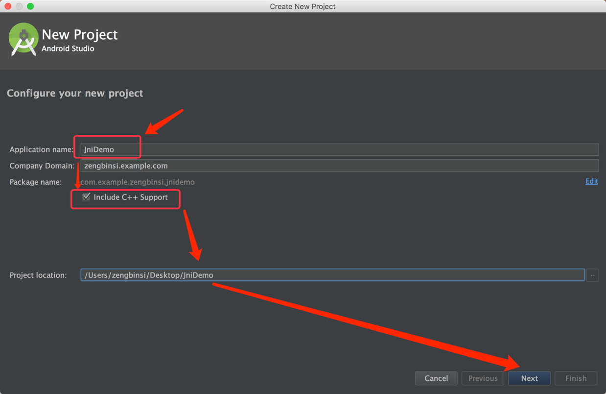
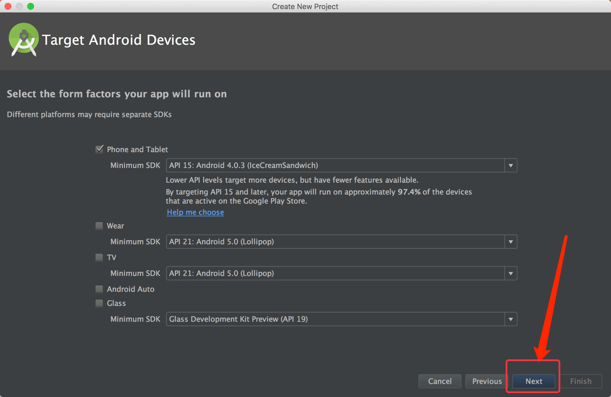
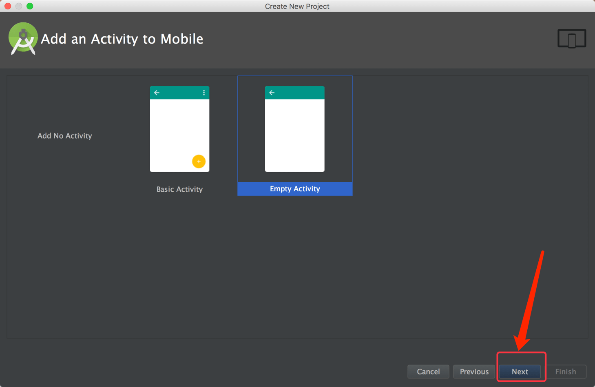
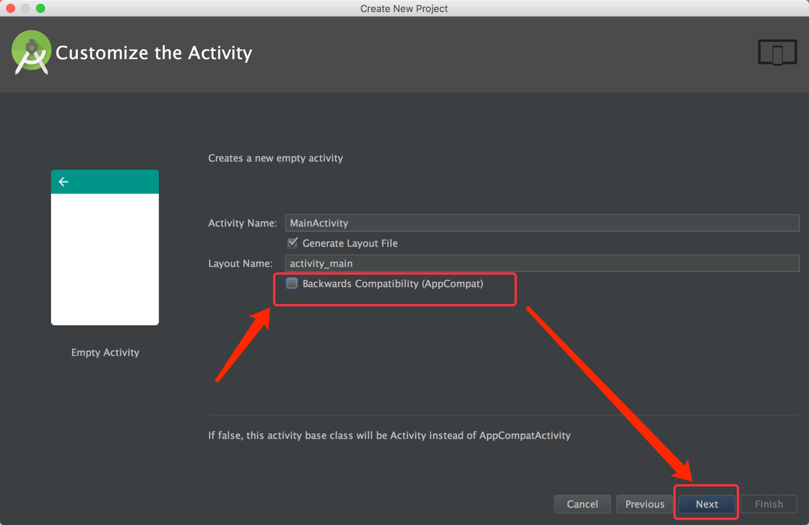
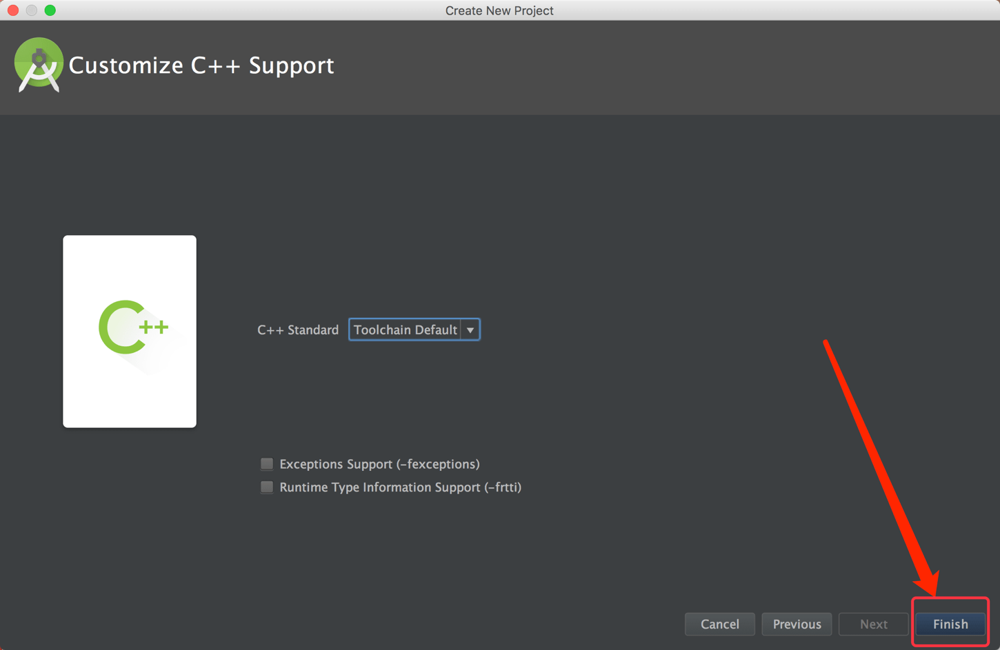
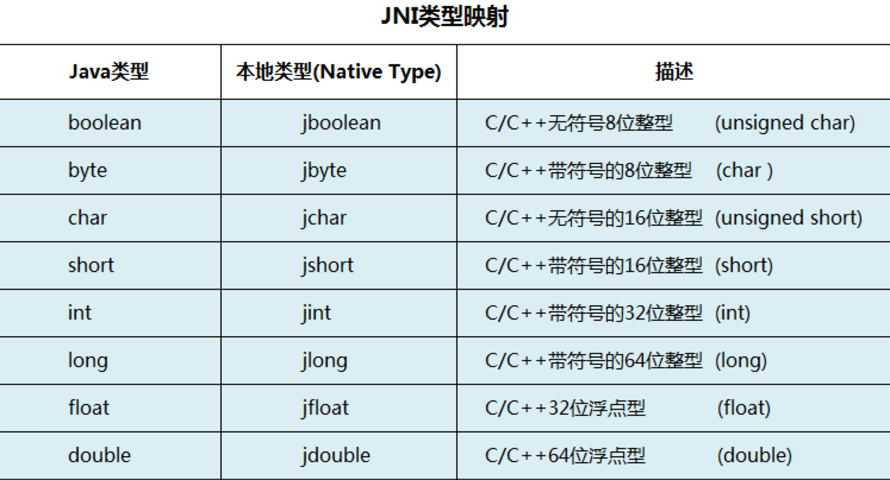
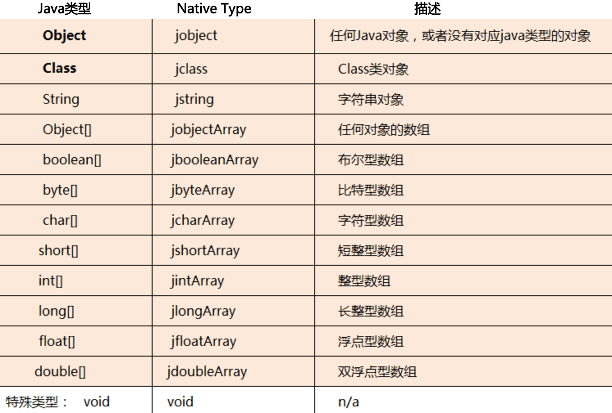
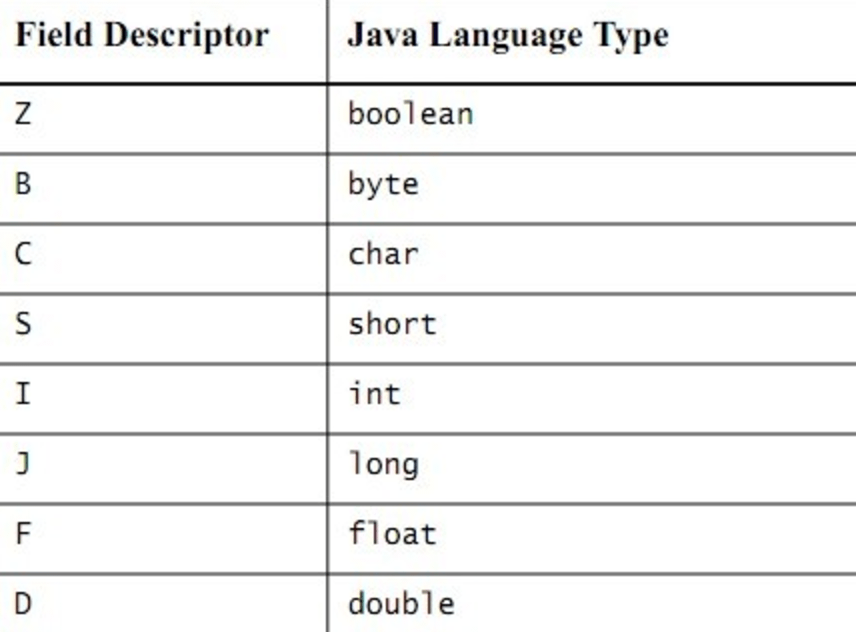
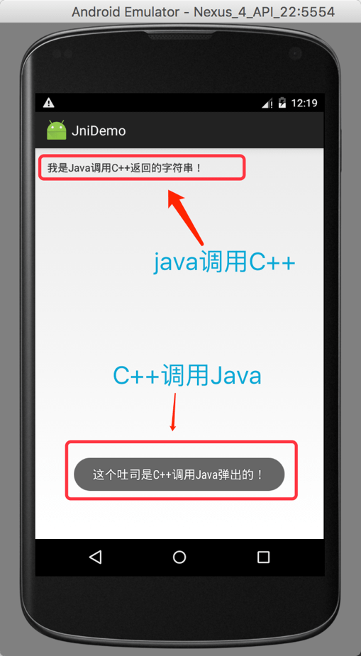
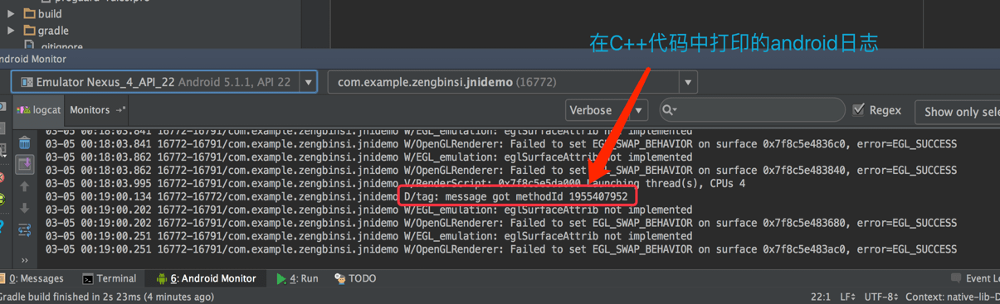

# Android Studio的JNI编程

## 一、创建项目


打开Android Studio(简称：AS)，点击“Start a new Android Studio project”来新建一个工程。



在Application name后面的文本框填写项目工程名称。  

勾选“Include C++ Support”（重要）。

完善其它信息，然后点击“Next”按钮。



直接下一步。



直接下一步。



直接下一步。



Finish。

## 二、Java代码


打开“app/src/mian/java/com.exampl.zengbinsi.jnidemo/MainActivity”文件。

在MainActivity类中默认生成了一个被“native”关键字修饰的“stringFromJNI()”方法。   

这是一个本地化方法，代码是C++实现的。点击方法求签名左边的双箭头符号，可以直接跳转到c++代码文件对应的实现。

修改MainActivity的代码如下：

``` java

package com.example.zengbinsi.jnidemo;

import android.app.Activity;
import android.os.Bundle;
import android.widget.TextView;
import android.widget.Toast;

public class MainActivity extends Activity {

    // Used to load the 'native-lib' library on application startup.
    // 引入JNI动态链接库 
    static {
        System.loadLibrary("native-lib");
    }

    @Override
    protected void onCreate(Bundle savedInstanceState) {
        super.onCreate(savedInstanceState);
        setContentView(R.layout.activity_main);

        // Example of a call to a native method
        TextView tv = (TextView) findViewById(R.id.sample_text);
        tv.setText(stringFromJNI());
			
		// 调用本地化方法
        this.callJavaMethod();
    }

	
	// 定义一个Java方法，供C++调用
    public int showDialog(String msg){
        Toast.makeText(this, msg, Toast.LENGTH_LONG).show();
        return 0;
    }

	// 本地化方法
    public native String stringFromJNI();
	// 本地化方法
    public native void callJavaMethod();
} 

```

## 三、C++代码

点击native方法左边的箭头符号，切换到对应的C++代码处，修改C++代码为：

```cpp

#include <jni.h>
#include <string>

// 引入android调试库
#include <android/log.h>

extern "C" {
	// 对应java/com.example.zengbinsi.jnidemo/MainActivity类的stringFromJNI方法的实现
    jstring Java_com_example_zengbinsi_jnidemo_MainActivity_stringFromJNI(JNIEnv *env, jobject /* this */)
    {	
    	// 定义一个C++字符串
        std::string hello = "我是Java调用C++返回的字符串！";
        // 通过NewStringUTF()方法，将C++字符串的c_str()转换成Java的字符串
        return env->NewStringUTF(hello.c_str());
    }


    JNIEXPORT void JNICALL Java_com_example_zengbinsi_jnidemo_MainActivity_callJavaMethod(JNIEnv *env, jobject instance)
    {
		// 获取C++要调用的Java方法 
        jmethodID notification_method = env->GetMethodID(env->GetObjectClass(instance), "showDialog", "(Ljava/lang/String;)I");

        // 在android上显示调试日志
        __android_log_print(ANDROID_LOG_DEBUG, "tag" ,"message %s %d", "got methodId", notification_method);

        std::string hello = "这个吐司是C++调用Java弹出的！";
		// 调用一个返回值为int的Java方法，并传递一个字符串参数
        env->CallIntMethod(instance, notification_method, env->NewStringUTF(hello.c_str()));

    }
}


```

C++本地化方法名包含了对应Java的类名和方法名，以下划线“_”分隔。

## 四、JNI类型对应

Java和C++类型对照：  
  
 

## 五、JNI签名

在Java中方法存在重载，所以调用Java方法的时候，需要提供方法的类型签名，以便JNIEnv找到正确的方法对象：
  

上图是简单类型的签名，对于类类型，其签名需要包括包名，以字符串String类为例，其签名类型为：

``` cpp
Ljava/lang/String;
```

**【注意】包名的分隔符为“/”，并且以分号“;”结尾**

在Java中，方法前面为：

```java
public void method1(String str, int index, boolean isForce)  
public String method2(String str, boolean isForce, boolean isForce)  
// 数组
public String[] method3(boolean isLeft, int[] arr)  
// 二维数组
public int[][] method4()  
```

其JNI签名为：

```cpp 
// method1
"(Ljava/lang/String;IZ)V"

// method2
"(Ljava/lang/String;ZZ)Ljava/lang/String;"

// method3
"(Z[I)[Ljava/lang/String;"

// method4
"()[[I"
```

## 六、运行结果

  
  