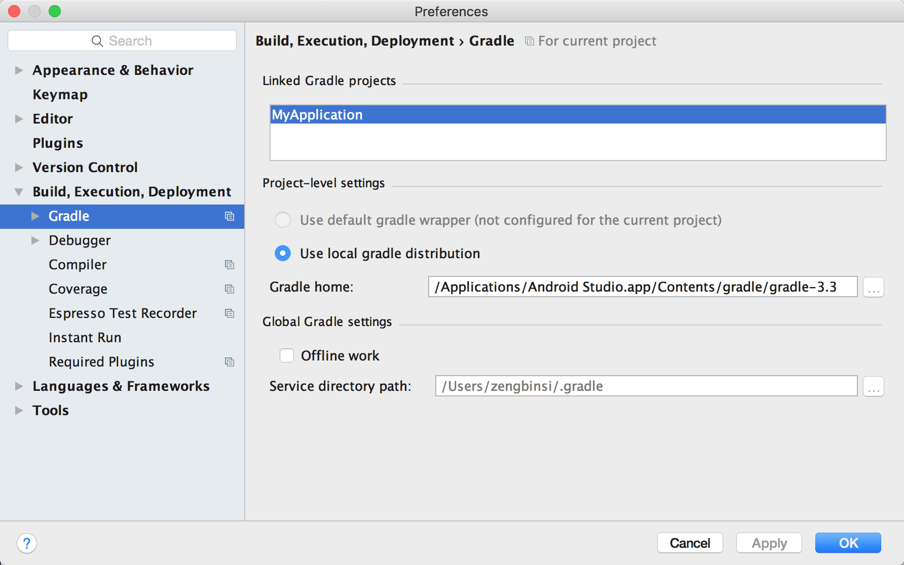

# Android Studio 环境搭建

## 前提

电脑上已经安装JDK、SDK等Android环境，具体可以上网搜索“android环境搭建”，有很多博客教程。

## 下载安装Android Studio

- Android Studio下载地址：[https://developer.android.google.cn/studio/index.html](https://developer.android.google.cn/studio/index.html)  

### Windows

在win上安装Android Studio(简称：AS)可以参考[这篇博客](http://www.cnblogs.com/xdp-gacl/p/4329469.html?utm_source=tuicool)。如果连接无法打开，上[百度](http://www.baidu.com)随便搜索下即可。

### Mac OSX

在mac上安装AS，直接双击打开，然后将AS图标拖放到“Application”应用程序文件夹，等拷贝完成即可。

## 离线Gradle

在新建AS工程后，发现程序一直显示“Build XXX gradle project info”，而且无法取消，只能通过杀进程的方式关闭AS。

打开刚刚创建的AS项目，找到项目下的“gradle\wrapper\gradle-wrapper.properties”这文件打开，可以看到类似：

```sh  
#Thu Jun 29 23:22:27 CST 2017
distributionBase=GRADLE_USER_HOME
distributionPath=wrapper/dists
zipStoreBase=GRADLE_USER_HOME
zipStorePath=wrapper/dists
distributionUrl=https\://services.gradle.org/distributions/gradle-3.3-all.zip

```  

在最后一行，发现“https://services.gradle.org/distributions/gradle-3.3-all.zip”这个东西根本无法下载（因为墙的问题，FQ后应该可以）。

所以我们可以通过下载离线文件的方式解决。

[gradle各个版本的下载链接](http://download.csdn.net/album/detail/2265)

根据上面的“gradle-x.x.x-all.zip”去下载对应的文件（比如我需要下载的是3.3版本的）。  

下载好之后，打开电脑上对应的gradle存放目录：

- win: C:\Users\zengbinsi\.gradle\wrapper\dists\
- mac: /Applications/Android\ Studio.app/Contents/gradle/  

将下载好的离线zip文件解压放在这里，然后修改项目下的“gradle\wrapper\gradle-wrapper.properties”的distributionUrl目录为刚刚解压的gradle的位置，重启AS等待gradle编译完成即可。

```sh
#Thu Jun 29 23:22:27 CST 2017
distributionBase=GRADLE_USER_HOME
distributionPath=wrapper/dists
zipStoreBase=GRADLE_USER_HOME
zipStorePath=wrapper/dists
#distributionUrl=https\://services.gradle.org/distributions/gradle-3.3-all.zip
distributionUrl=/Applications/Android\ Studio.app/Contents/gradle/gradle-3.3-all
```

## 环境变量

如果还是不行，可以尝试将解压的离线gradle目录配置成环境变量GRADLE_HOME，win上的环境变量参照jdk或者android sdk的方式，百度下就有。mac上将下面几行写入“.bash_profile”（是一个隐藏文件），然后再终端运行“source .bash_profile”使其生效。

```sh
# Add gradle environment for Android studio by zengbinsi
GRADLE_HOME=/Applications/Android\ Studio.app/Contents/gradle/gradle-3.3
export GRADLE_HOME
export PATH=$PATH:$GRADLE_HOME/bin
```

## 补充



如果有需要，在打开项目后，可以进入AS的设置界面，找到“Build, Execution, Deployment”-“Build Tools”-“Gradle”在“Linked Gradle projects”里面选中当前项目，然后再下面的“Use local gradle distribution”文本框里面也设置成刚刚解压的离线gradle目录“/Applications/Android\ Studio.app/Contents/gradle/gradle-3.3-all”，然后重启AS。
