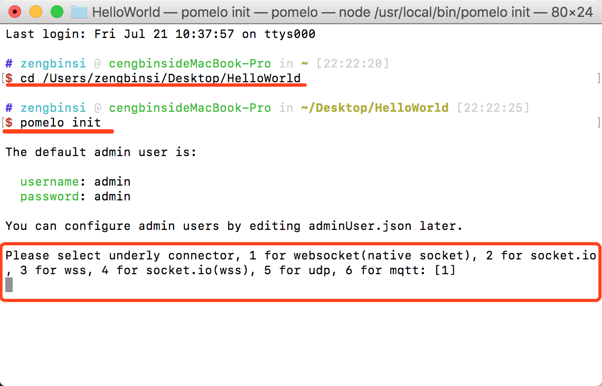

# 初识Pomelo

## 简介

Pomelo是网易的游戏服务端框架，虽然说是游戏服务端框架，但是它的很多核心跟通俗的应用服务端是通用的。pomelo是基于Node.JS封装的，具有天生的多进程分布式特征。

## 安装Node.JS

在安装Pomelo之前需要全局安装Node.JS，Node.JS的下载链接是:  

- [https://nodejs.org/en/download/](https://nodejs.org/en/download/)  
- [http://nodejs.cn/download/](http://nodejs.cn/download/)

根据系统找到对应的版本进行下载安装即可（具体的可以自己上网搜索下Node.JS相关的博客或者教程里面都有）。


## 安装Pomelo

安装好node之后，可以使用npm(node包管理工具)全局安装pomelo:

```sh
npm install pomelo -g
```

如果安装node.JS后配置了cnpm，那么可以使用cnpm来安装：  

```sh
cnpm install pomelo -g
```

如果安装过程中没有报错误，说明安装成功。  

## 新建项目

新建一个空文件夹HelloWorld，cd到文件夹下，执行init命令：

```sh
cd HelloWorld
pomelo init
```

  

执行init命令的时候，控制台光标会停在这个位置，需要选择网络连接方式：

- 1：websocket
- 2：socket.io
- 3：wss
- 4：socket.io(wss)
- 5：udp
- 6：mqtt

可以根据实际项目情况选择需要的网络连接方式，现在我们可以选择了1。

其实，对于websocket还是socket.io，pomelo都提供了相同的API进行操作。

## 安装依赖

pomelo是基于node.js的工程，所以不可避免的会需要用到一些node.js的包，我们需要在项目下安装node.js的依赖包。

**mac OSX下，我们可以在终端执行：**

```sh
sh npm-install.sh
```

**windows下，我们需要在终端运行npm-install.bat批处理文件：**

```sh
npm-install.bat
```

如果配置了cnpm，那么我们可以打开对应的npm-install脚本，修改里面的npm命令为对应的cnpm，然后保存关闭后再执行。

安装成功后，在项目的game-server和web-server下都会多出一个node_modules文件夹，里面就是刚刚安装的依赖包。

## 项目目录结构

在新建项目的目录下有三个文件夹，分别是：game-server、web-server和shared。

### shared

由于JS的各方面条件，现在很多的游戏客户端也采用JS进行开发，而pomelo也是基于JS的，所以有些算法、或者功能模块是可以被服务端和客户端所共用的。这部分代码就可以放置在shared目录下，这样充分体现了pomelo所提倡代码高重用性。  

### web-server

web-server是一个网页客户端目录，里面存放的是web客户端的代码，以app.js为入口文件。这里我们不做过多的阐述。

### game-server

这里面就是使用pomelo框架开发的游戏服务端的代码。在game-server下有app、config和logs三个文件夹，还有刚刚安装的node_modules。项目同样以app.js为入口文件。

- app：项目所有功能性的代码都放在这目录下。    
- config：项目的所有配置，包括pomelo和游戏服务端的逻辑相关的配置。    
- logs：服务端运行生成的日志。    

**【在config里面，多了一个adminServer.json文件，如果我们有新增服务端类型（比如：gate服务器），需要在这里配置token信息，否则会一直显示注册服务器到master失败。token可以自定义，或者生成一个足够长的字符串即可，甚至可以多个服务端公用一个token，主要取决于对项目安全性的要求。】**

## 运行项目

运行game-server的命令如下：

```sh
cd game-server
pomelo start
```

运行web-server的命令如下：

```sh
cd web-server
node app
```

如果运行过程中提示端口冲突，我们修改config下的server.json文件中的端口和web-server/public/index.html中对应的端口即可。

## 启动客户端

由于HelloWorld是一个web客户端，所以当启动web-server后，在浏览器访问对应的页面即可。


