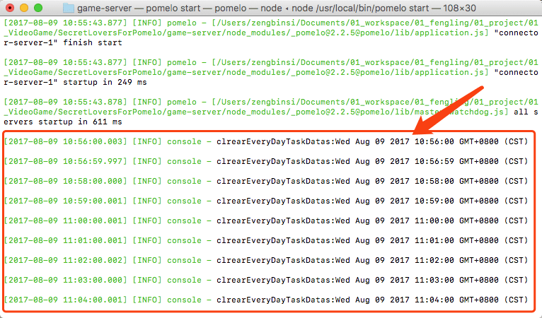

# Pomelo定时任务

制作定时任务可以使用cron来实现，具体的可以网上搜索“cron定时任务”。这里介绍在Pomelo中如何实现定时任务。

## 编写任务

在项目game-server/app/servers下面新建一个“servertask”文件夹（文件夹名称任意），在servertask下新建一个“cron”文件夹，在cron文件夹下新建一个名为“servertaskCron.js”的代码文件，servertaskCron代码如下：

```js
var schedule = require('node-schedule');

module.exports = function(app) {  
  return new Cron(app);  
};  

var Cron = function(app) {  
  this.app = app;  
};  
  
  
/**
 * 清空每日任务数据
 */
Cron.prototype.clrearEveryDayTaskDatas = function() {  
    console.log('clrearEveryDayTaskDatas:' + new Date());
};  
```

## 添加定时任务服务器配置

在game-server/config/servers.json中添加servertask的服务器配置：

```
"servertask": [
	{"id": "servertask-server-1", "host": "127.0.0.1", "port": 9000, "clientHost": "127.0.0.1", "clientPort": 9010}
]
```

## 添加服务器token

在新版本的Pomelo中，config目录下新增了一个adminServer.json配置，在里面添加一个servertask的配置，否则启动servertask的时候会提示注册服务器到master失败。

```
{
    "type": "servertask",
    "token": "agarxhqb98rpajloaxn34ga8xrunpagkjwlaw3ruxnpaagl29w4rxn"
}
```

token字段的值可以任意，用一个足够长的字符串或者所有服务器公用一个token也行，主要取决于你的服务器安全级别。

## 添加cron配置

在game-server/config目录下新建一个“crons.json”文件，配置如下：

```
{  
    "development":{  
         "servertask": [  
          {"id": 1, "time": "0 0/1 * * * *", "action": "servertaskCron.clrearEveryDayTaskDatas"}  
          ]  
    },  
    "production":{  
          "servertask": [  
          {"id": 1, "time": "0 0/1 * * * *", "action": "servertaskCron.clrearEveryDayTaskDatas"}  
          ]  
    }  
}  
```

id是定时任务在具体服务器的唯一标识，且不能在同一服务器中重复。  
time是定时任务执行的具体时间，时间的定义跟linux的定时任务类似，一共包括7个字段，每个字段的具体定义如下：

"* * * * * * [command]"

action是具体执行任务方法，servertaskCron.clrearEveryDayTaskDatas则代表执行game-server/app/servers/servertask/cron/servertaskCron.js中的clrearEveryDayTaskDatas方法。  


## 定时任务时间定义格式

"* * * * * * [command]"  
"秒 分 时 日 月 星期 [运行命令,可省略]"

秒的取值范围[0, 59]。  
分的取值范围[0, 59]。  
时的取值范围[0, 23]。  
日的取值范围[1, 31]。  
月的取值范围[0, 11]。  
星期的取值范围[0, 6]，0表示星期天。  

\*：表示任何时刻  
,：表示分割  
-：表示一个段，如第二端里： 1-5，就表示1到5点  
/n: 表示每个n的单位执行一次，如第二段里，*/1, 就表示每隔1个小时执行一次命令。也可以写成1-23/1.

**【在Pomelo里面用*/1报错，改成0/1就可以了】**

## 运行测试

使用 pomelo start 启动服务器



