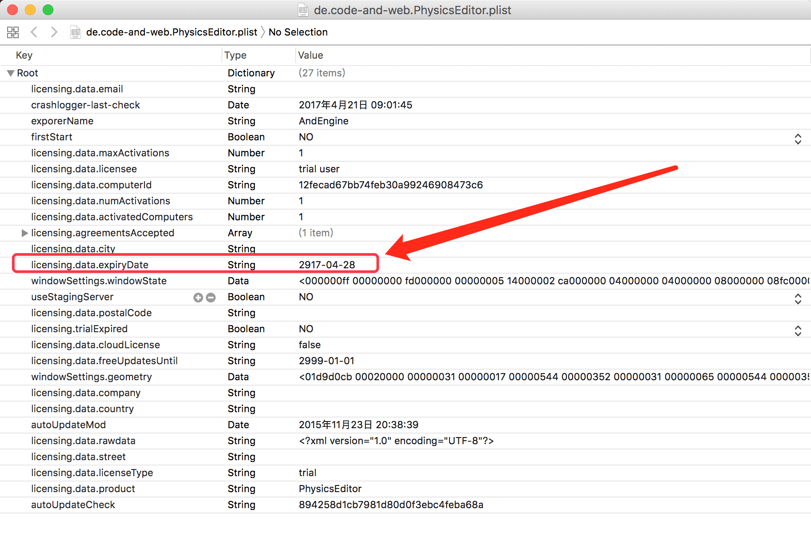
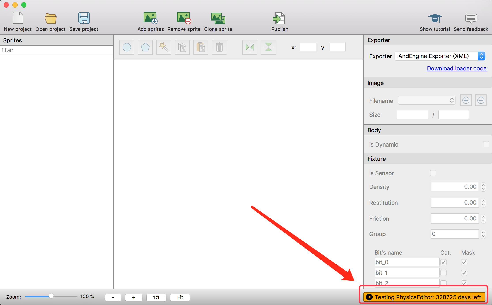

# PhysicsEditor试用期破解

##【声明】  
软件开发不易，使用请购买正版！（本教程仅供学习交流使用）  
软件开发不易，使用请购买正版！（本教程仅供学习交流使用）  
软件开发不易，使用请购买正版！（本教程仅供学习交流使用）  

## 步骤

- 安装PhysicsEditor。
- 打开已安装的PhysicsEditor，试用。这时候会在“/Users/这里是用户名/Library/Preferences”（就是在系统资源库）下生成一个“de.code-and-web.PhysicsEditor.plist”配置文件。  
- 关掉PhysicsEditor。
- 双击打开“de.code-and-web.PhysicsEditor.plist”文件。修改“licensing.data.expiryDate”的时间保存即可。  

  

- 重新运行PhysicsEditor。 

  
